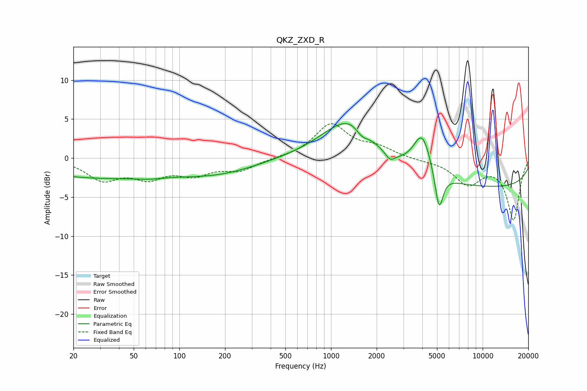

# QKZ_ZXD_R
See [usage instructions](https://github.com/jaakkopasanen/AutoEq#usage) for more options and info.

### Parametric EQs
Apply preamp of -4.5 dB when using parametric equalizer.

|   # | Type    |   Fc (Hz) |    Q |   Gain (dB) |
|-----|---------|-----------|------|-------------|
|   1 | Peaking |        29 | 0.3  |        -2.4 |
|   2 | Peaking |        63 | 1.86 |        -0.2 |
|   3 | Peaking |       181 | 0.53 |        -1.7 |
|   4 | Peaking |      1294 | 0.76 |         4.9 |
|   5 | Peaking |      1391 | 1.5  |         0.8 |
|   6 | Peaking |      1597 | 3.51 |        -1   |
|   7 | Peaking |      2451 | 4.36 |        -1   |
|   8 | Peaking |      3994 | 2.37 |         5.2 |
|   9 | Peaking |      5159 | 5.21 |        -5   |
|  10 | Peaking |     10000 | 0.18 |        -3.8 |

### Fixed Band EQs
When using fixed band (also called graphic) equalizer, apply preamp of **-4.5 dB** (if available) and set gains manually with these parameters.

|   # | Type    |   Fc (Hz) |    Q |   Gain (dB) |
|-----|---------|-----------|------|-------------|
|   1 | Peaking |        31 | 1.41 |        -2.6 |
|   2 | Peaking |        62 | 1.41 |        -2.2 |
|   3 | Peaking |       125 | 1.41 |        -1.8 |
|   4 | Peaking |       250 | 1.41 |        -1.4 |
|   5 | Peaking |       500 | 1.41 |         0   |
|   6 | Peaking |      1000 | 1.41 |         4.3 |
|   7 | Peaking |      2000 | 1.41 |         1.2 |
|   8 | Peaking |      4000 | 1.41 |        -0.2 |
|   9 | Peaking |      8000 | 1.41 |        -3.2 |
|  10 | Peaking |     16000 | 1.41 |        -7.8 |

### Graphs

