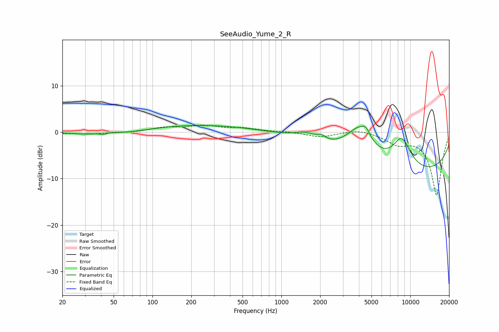

# SeeAudio_Yume_2_R
See [usage instructions](https://github.com/jaakkopasanen/AutoEq#usage) for more options and info.

### Parametric EQs
Apply preamp of -1.5 dB when using parametric equalizer.

|   # | Type    |   Fc (Hz) |    Q |   Gain (dB) |
|-----|---------|-----------|------|-------------|
|   1 | Peaking |        42 | 5.93 |        -0.4 |
|   2 | Peaking |        46 | 1.87 |         0.5 |
|   3 | Peaking |        53 | 0.54 |        -1.5 |
|   4 | Peaking |       172 | 0.27 |         1.8 |
|   5 | Peaking |      1550 | 1.64 |         1.5 |
|   6 | Peaking |      2043 | 4.76 |         0.9 |
|   7 | Peaking |      4023 | 1.35 |         6.6 |
|   8 | Peaking |      4532 | 4.84 |         1.5 |
|   9 | Peaking |      8594 | 1.79 |         6.4 |
|  10 | Peaking |      9973 | 0.2  |        -8.8 |

### Fixed Band EQs
When using fixed band (also called graphic) equalizer, apply preamp of **-1.6 dB** (if available) and set gains manually with these parameters.

|   # | Type    |   Fc (Hz) |    Q |   Gain (dB) |
|-----|---------|-----------|------|-------------|
|   1 | Peaking |        31 | 1.41 |        -0.5 |
|   2 | Peaking |        62 | 1.41 |        -0.1 |
|   3 | Peaking |       125 | 1.41 |         0.9 |
|   4 | Peaking |       250 | 1.41 |         1.3 |
|   5 | Peaking |       500 | 1.41 |         0.7 |
|   6 | Peaking |      1000 | 1.41 |         0.1 |
|   7 | Peaking |      2000 | 1.41 |        -1   |
|   8 | Peaking |      4000 | 1.41 |         0.7 |
|   9 | Peaking |      8000 | 1.41 |        -2.2 |
|  10 | Peaking |     16000 | 1.41 |       -13.5 |

### Graphs

