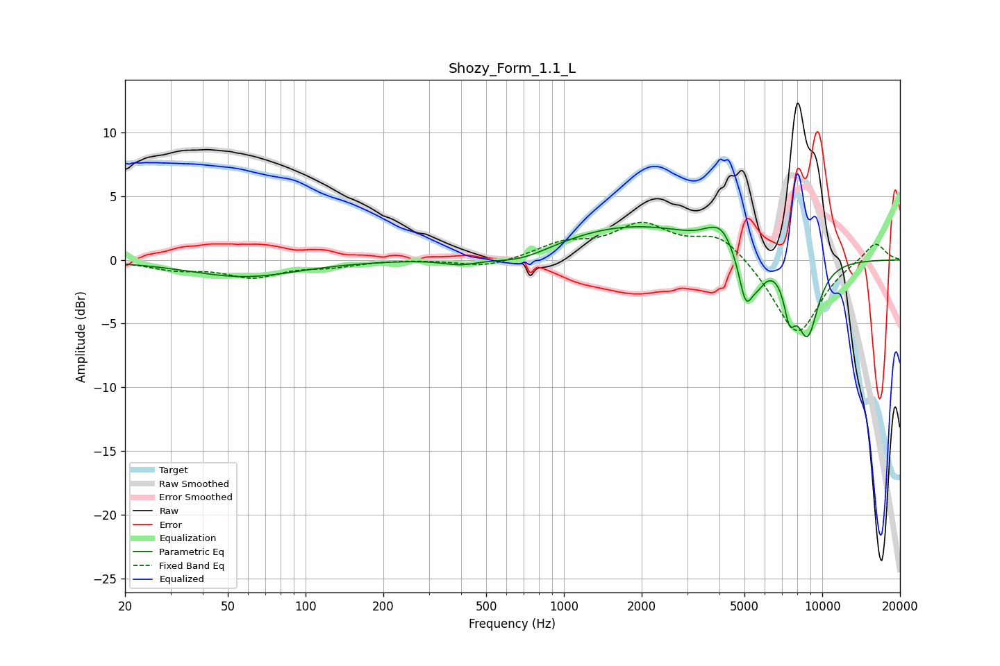

# Shozy_Form_1.1_L
See [usage instructions](https://github.com/jaakkopasanen/AutoEq#usage) for more options and info.

### Parametric EQs
Apply preamp of -2.7 dB when using parametric equalizer.

|   # | Type    |   Fc (Hz) |    Q |   Gain (dB) |
|-----|---------|-----------|------|-------------|
|   1 | Peaking |        58 | 0.67 |        -1.3 |
|   2 | Peaking |       398 | 2    |        -0.5 |
|   3 | Peaking |       685 | 1.2  |        -1   |
|   4 | Peaking |      1853 | 0.46 |         2.7 |
|   5 | Peaking |      3573 | 4.44 |         0.2 |
|   6 | Peaking |      4064 | 3.09 |         1.5 |
|   7 | Peaking |      5056 | 5.15 |        -3.6 |
|   8 | Peaking |      5635 | 4.09 |        -1.5 |
|   9 | Peaking |      7472 | 5.97 |        -3   |
|  10 | Peaking |      8760 | 2.86 |        -5.9 |

### Fixed Band EQs
When using fixed band (also called graphic) equalizer, apply preamp of **-3.0 dB** (if available) and set gains manually with these parameters.

|   # | Type    |   Fc (Hz) |    Q |   Gain (dB) |
|-----|---------|-----------|------|-------------|
|   1 | Peaking |        31 | 1.41 |        -0.7 |
|   2 | Peaking |        62 | 1.41 |        -1.2 |
|   3 | Peaking |       125 | 1.41 |        -0.4 |
|   4 | Peaking |       250 | 1.41 |         0.1 |
|   5 | Peaking |       500 | 1.41 |        -0.6 |
|   6 | Peaking |      1000 | 1.41 |         1.2 |
|   7 | Peaking |      2000 | 1.41 |         2.6 |
|   8 | Peaking |      4000 | 1.41 |         2.1 |
|   9 | Peaking |      8000 | 1.41 |        -6   |
|  10 | Peaking |     16000 | 1.41 |         1.5 |

### Graphs

