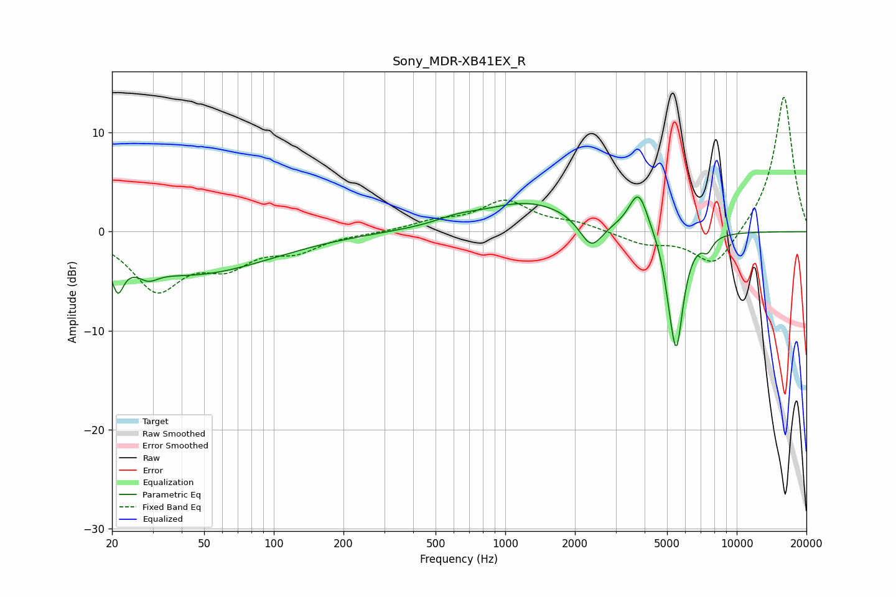

# Sony_MDR-XB41EX_R
See [usage instructions](https://github.com/jaakkopasanen/AutoEq#usage) for more options and info.

### Parametric EQs
Apply preamp of -3.6 dB when using parametric equalizer.

|   # | Type    |   Fc (Hz) |    Q |   Gain (dB) |
|-----|---------|-----------|------|-------------|
|   1 | Peaking |        21 | 5.83 |        -3.1 |
|   2 | Peaking |        29 | 3.53 |        -1   |
|   3 | Peaking |        44 | 0.41 |        -4.3 |
|   4 | Peaking |       614 | 1.6  |         0.6 |
|   5 | Peaking |      1280 | 0.66 |         3   |
|   6 | Peaking |      2351 | 2.82 |        -3   |
|   7 | Peaking |      3768 | 3.39 |         4.1 |
|   8 | Peaking |      5142 | 5.68 |        -1.9 |
|   9 | Peaking |      5495 | 4.52 |       -11.1 |
|  10 | Peaking |      7483 | 6    |        -1.3 |

### Fixed Band EQs
When using fixed band (also called graphic) equalizer, apply preamp of **-13.7 dB** (if available) and set gains manually with these parameters.

|   # | Type    |   Fc (Hz) |    Q |   Gain (dB) |
|-----|---------|-----------|------|-------------|
|   1 | Peaking |        31 | 1.41 |        -5.6 |
|   2 | Peaking |        62 | 1.41 |        -2.9 |
|   3 | Peaking |       125 | 1.41 |        -1.7 |
|   4 | Peaking |       250 | 1.41 |        -0.1 |
|   5 | Peaking |       500 | 1.41 |         0.9 |
|   6 | Peaking |      1000 | 1.41 |         3   |
|   7 | Peaking |      2000 | 1.41 |         0.7 |
|   8 | Peaking |      4000 | 1.41 |        -1.2 |
|   9 | Peaking |      8000 | 1.41 |        -3.8 |
|  10 | Peaking |     16000 | 1.41 |        13.9 |

### Graphs

