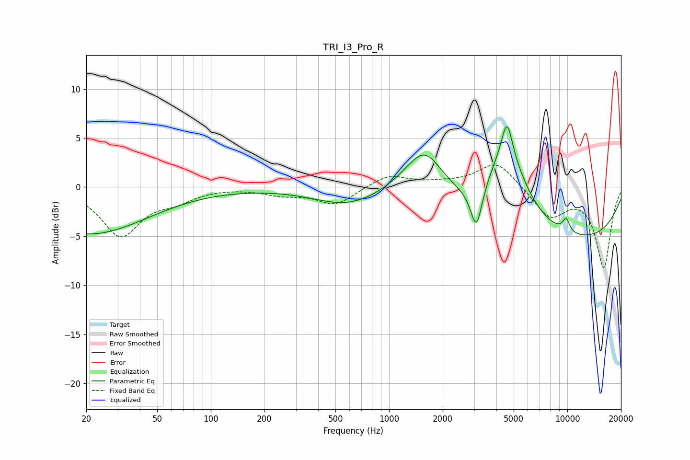

# TRI_I3_Pro_R
See [usage instructions](https://github.com/jaakkopasanen/AutoEq#usage) for more options and info.

### Parametric EQs
Apply preamp of -6.3 dB when using parametric equalizer.

|   # | Type    |   Fc (Hz) |    Q |   Gain (dB) |
|-----|---------|-----------|------|-------------|
|   1 | Peaking |        21 | 0.43 |        -4.8 |
|   2 | Peaking |       579 | 0.76 |        -1.7 |
|   3 | Peaking |      1562 | 1.13 |         5.2 |
|   4 | Peaking |      1623 | 2.58 |         0.4 |
|   5 | Peaking |      3089 | 4.35 |        -4.4 |
|   6 | Peaking |      4557 | 1.16 |         7.9 |
|   7 | Peaking |      4586 | 4.92 |         3.5 |
|   8 | Peaking |      8094 | 0.2  |        -5.9 |
|   9 | Peaking |      9876 | 5.99 |         2.4 |
|  10 | Peaking |      9916 | 5.92 |        -1.1 |

### Fixed Band EQs
When using fixed band (also called graphic) equalizer, apply preamp of **-2.3 dB** (if available) and set gains manually with these parameters.

|   # | Type    |   Fc (Hz) |    Q |   Gain (dB) |
|-----|---------|-----------|------|-------------|
|   1 | Peaking |        31 | 1.41 |        -4.9 |
|   2 | Peaking |        62 | 1.41 |        -1.1 |
|   3 | Peaking |       125 | 1.41 |         0   |
|   4 | Peaking |       250 | 1.41 |        -0.7 |
|   5 | Peaking |       500 | 1.41 |        -1.8 |
|   6 | Peaking |      1000 | 1.41 |         1.3 |
|   7 | Peaking |      2000 | 1.41 |         0.3 |
|   8 | Peaking |      4000 | 1.41 |         2.7 |
|   9 | Peaking |      8000 | 1.41 |        -3   |
|  10 | Peaking |     16000 | 1.41 |        -8.1 |

### Graphs

