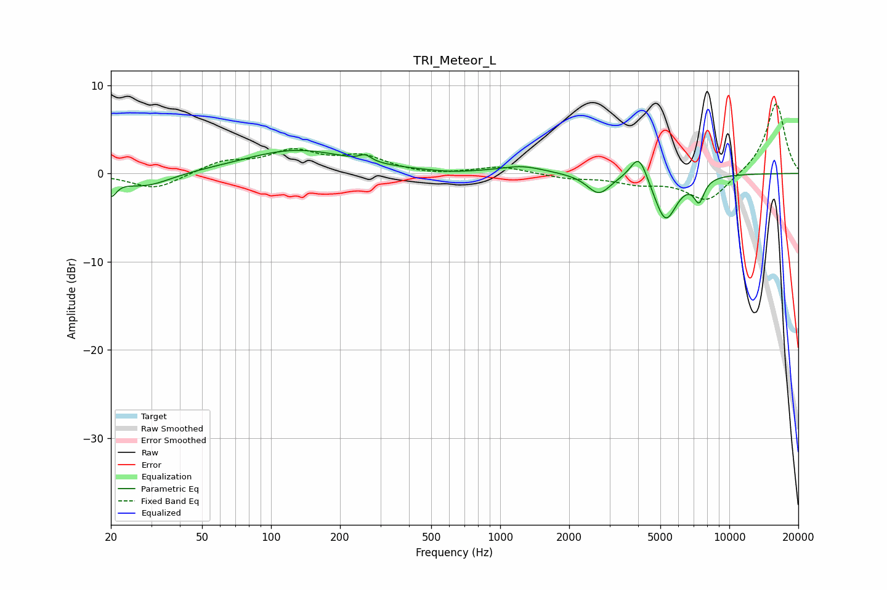

# TRI_Meteor_L
See [usage instructions](https://github.com/jaakkopasanen/AutoEq#usage) for more options and info.

### Parametric EQs
Apply preamp of -2.7 dB when using parametric equalizer.

|   # | Type    |   Fc (Hz) |    Q |   Gain (dB) |
|-----|---------|-----------|------|-------------|
|   1 | Peaking |        20 | 5.9  |        -1.9 |
|   2 | Peaking |        28 | 1.27 |        -1.6 |
|   3 | Peaking |       129 | 0.62 |         2.7 |
|   4 | Peaking |       258 | 5.57 |         0.7 |
|   5 | Peaking |       605 | 1.81 |        -0.2 |
|   6 | Peaking |      1245 | 1.46 |         0.8 |
|   7 | Peaking |      2694 | 2.81 |        -2.3 |
|   8 | Peaking |      4035 | 3.75 |         3.2 |
|   9 | Peaking |      5264 | 2.77 |        -5.4 |
|  10 | Peaking |      7382 | 5.93 |        -2.5 |

### Fixed Band EQs
When using fixed band (also called graphic) equalizer, apply preamp of **-8.0 dB** (if available) and set gains manually with these parameters.

|   # | Type    |   Fc (Hz) |    Q |   Gain (dB) |
|-----|---------|-----------|------|-------------|
|   1 | Peaking |        31 | 1.41 |        -1.8 |
|   2 | Peaking |        62 | 1.41 |         1.3 |
|   3 | Peaking |       125 | 1.41 |         2.3 |
|   4 | Peaking |       250 | 1.41 |         1.8 |
|   5 | Peaking |       500 | 1.41 |        -0.3 |
|   6 | Peaking |      1000 | 1.41 |         0.8 |
|   7 | Peaking |      2000 | 1.41 |        -0.5 |
|   8 | Peaking |      4000 | 1.41 |        -1   |
|   9 | Peaking |      8000 | 1.41 |        -3.2 |
|  10 | Peaking |     16000 | 1.41 |         8.1 |

### Graphs

