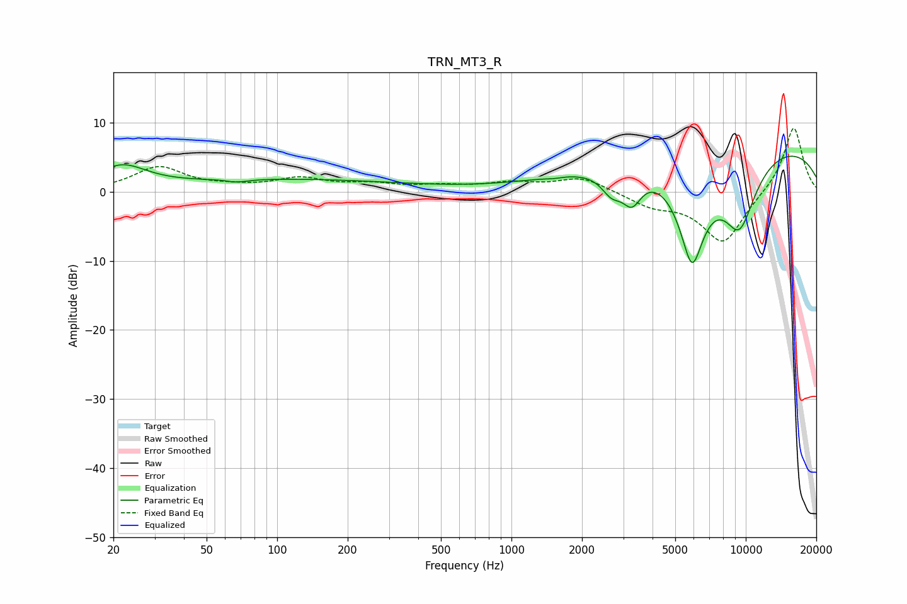

# TRN_MT3_R
See [usage instructions](https://github.com/jaakkopasanen/AutoEq#usage) for more options and info.

### Parametric EQs
Apply preamp of -5.2 dB when using parametric equalizer.

|   # | Type    |   Fc (Hz) |    Q |   Gain (dB) |
|-----|---------|-----------|------|-------------|
|   1 | Peaking |        22 | 1.34 |         3.3 |
|   2 | Peaking |        68 | 4.33 |        -1.4 |
|   3 | Peaking |        69 | 5.01 |         1   |
|   4 | Peaking |       111 | 0.28 |         1.7 |
|   5 | Peaking |      1504 | 4.25 |        -0.2 |
|   6 | Peaking |      2676 | 3.13 |        -2.9 |
|   7 | Peaking |      3266 | 3.38 |        -4.2 |
|   8 | Peaking |      5896 | 2.21 |       -14.6 |
|   9 | Peaking |      9390 | 0.19 |         7.5 |
|  10 | Peaking |      9393 | 1.6  |       -10.6 |

### Fixed Band EQs
When using fixed band (also called graphic) equalizer, apply preamp of **-9.3 dB** (if available) and set gains manually with these parameters.

|   # | Type    |   Fc (Hz) |    Q |   Gain (dB) |
|-----|---------|-----------|------|-------------|
|   1 | Peaking |        31 | 1.41 |         3.5 |
|   2 | Peaking |        62 | 1.41 |         0.5 |
|   3 | Peaking |       125 | 1.41 |         1.7 |
|   4 | Peaking |       250 | 1.41 |         0.9 |
|   5 | Peaking |       500 | 1.41 |         0.7 |
|   6 | Peaking |      1000 | 1.41 |         1.1 |
|   7 | Peaking |      2000 | 1.41 |         2.1 |
|   8 | Peaking |      4000 | 1.41 |        -1.8 |
|   9 | Peaking |      8000 | 1.41 |        -7.5 |
|  10 | Peaking |     16000 | 1.41 |         9.6 |

### Graphs

