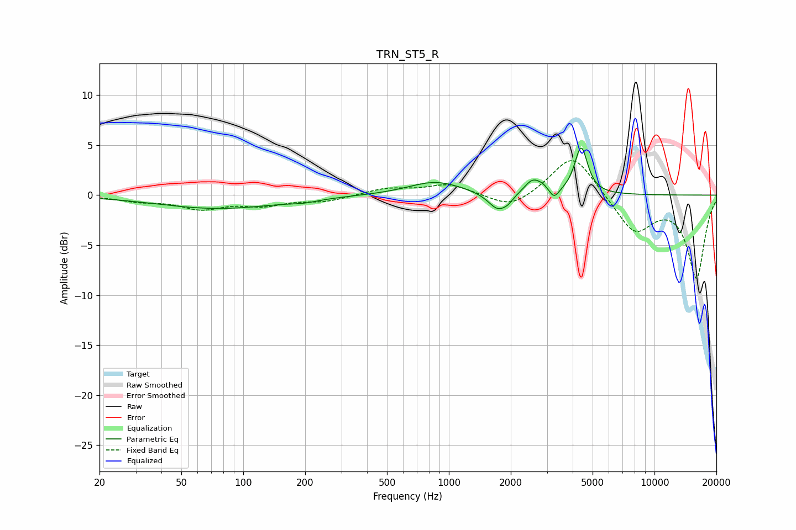

# TRN_ST5_R
See [usage instructions](https://github.com/jaakkopasanen/AutoEq#usage) for more options and info.

### Parametric EQs
Apply preamp of -4.8 dB when using parametric equalizer.

|   # | Type    |   Fc (Hz) |    Q |   Gain (dB) |
|-----|---------|-----------|------|-------------|
|   1 | Peaking |        75 | 0.48 |        -1.3 |
|   2 | Peaking |       198 | 2.1  |        -0.2 |
|   3 | Peaking |       861 | 1.08 |         1.4 |
|   4 | Peaking |      1735 | 2.99 |        -1.8 |
|   5 | Peaking |      1941 | 6    |        -0.4 |
|   6 | Peaking |      2548 | 3.54 |         1.4 |
|   7 | Peaking |      2865 | 4.79 |         0.4 |
|   8 | Peaking |      3249 | 6    |        -1   |
|   9 | Peaking |      4388 | 4.48 |         4.3 |
|  10 | Peaking |      4487 | 6    |         0.4 |

### Fixed Band EQs
When using fixed band (also called graphic) equalizer, apply preamp of **-3.5 dB** (if available) and set gains manually with these parameters.

|   # | Type    |   Fc (Hz) |    Q |   Gain (dB) |
|-----|---------|-----------|------|-------------|
|   1 | Peaking |        31 | 1.41 |        -0.5 |
|   2 | Peaking |        62 | 1.41 |        -1.2 |
|   3 | Peaking |       125 | 1.41 |        -0.9 |
|   4 | Peaking |       250 | 1.41 |        -0.6 |
|   5 | Peaking |       500 | 1.41 |         0.7 |
|   6 | Peaking |      1000 | 1.41 |         1.1 |
|   7 | Peaking |      2000 | 1.41 |        -1.5 |
|   8 | Peaking |      4000 | 1.41 |         4.3 |
|   9 | Peaking |      8000 | 1.41 |        -3.7 |
|  10 | Peaking |     16000 | 1.41 |        -8.2 |

### Graphs

