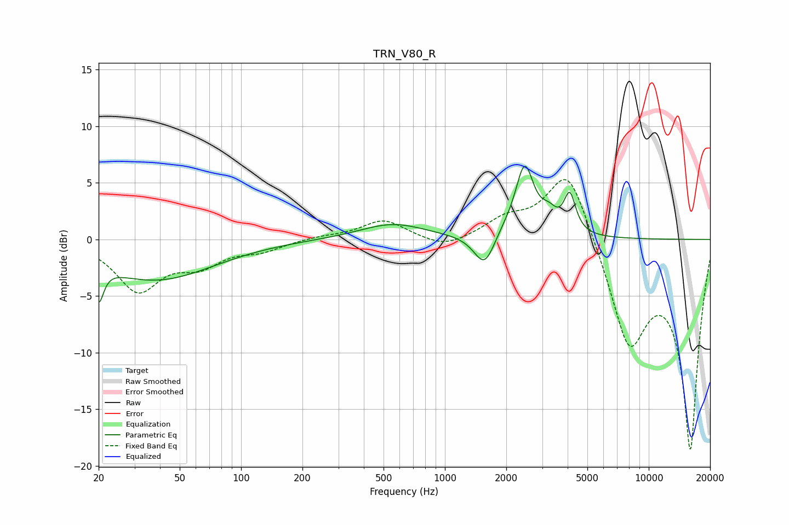

# TRN_V80_R
See [usage instructions](https://github.com/jaakkopasanen/AutoEq#usage) for more options and info.

### Parametric EQs
Apply preamp of -6.6 dB when using parametric equalizer.

|   # | Type    |   Fc (Hz) |    Q |   Gain (dB) |
|-----|---------|-----------|------|-------------|
|   1 | Peaking |        20 | 5.99 |        -3.1 |
|   2 | Peaking |        38 | 0.5  |        -3.6 |
|   3 | Peaking |       554 | 0.89 |         1.4 |
|   4 | Peaking |       562 | 1.95 |        -0   |
|   5 | Peaking |      1568 | 2.73 |        -3   |
|   6 | Peaking |      1947 | 1.95 |         0.6 |
|   7 | Peaking |      2462 | 3.19 |         6.1 |
|   8 | Peaking |      3150 | 5.72 |        -0.2 |
|   9 | Peaking |      3211 | 3.7  |         1.6 |
|  10 | Peaking |      4099 | 4.94 |         3.4 |

### Fixed Band EQs
When using fixed band (also called graphic) equalizer, apply preamp of **-5.4 dB** (if available) and set gains manually with these parameters.

|   # | Type    |   Fc (Hz) |    Q |   Gain (dB) |
|-----|---------|-----------|------|-------------|
|   1 | Peaking |        31 | 1.41 |        -4.4 |
|   2 | Peaking |        62 | 1.41 |        -1.9 |
|   3 | Peaking |       125 | 1.41 |        -0.8 |
|   4 | Peaking |       250 | 1.41 |         0.3 |
|   5 | Peaking |       500 | 1.41 |         1.7 |
|   6 | Peaking |      1000 | 1.41 |        -0.9 |
|   7 | Peaking |      2000 | 1.41 |         1.6 |
|   8 | Peaking |      4000 | 1.41 |         6.7 |
|   9 | Peaking |      8000 | 1.41 |        -8.9 |
|  10 | Peaking |     16000 | 1.41 |       -18.3 |

### Graphs

