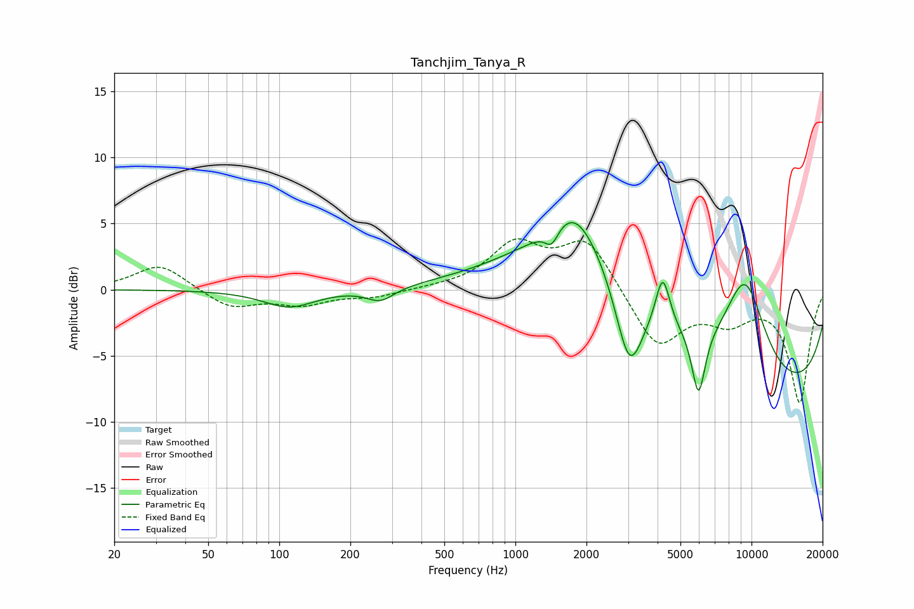

# Tanchjim_Tanya_R
See [usage instructions](https://github.com/jaakkopasanen/AutoEq#usage) for more options and info.

### Parametric EQs
Apply preamp of -5.2 dB when using parametric equalizer.

|   # | Type    |   Fc (Hz) |    Q |   Gain (dB) |
|-----|---------|-----------|------|-------------|
|   1 | Peaking |       110 | 1.29 |        -1.3 |
|   2 | Peaking |       268 | 2.41 |        -1   |
|   3 | Peaking |      1425 | 4.96 |        -1.3 |
|   4 | Peaking |      1779 | 1.41 |         3.2 |
|   5 | Peaking |      2256 | 0.44 |         6.5 |
|   6 | Peaking |      3039 | 2.29 |        -6.9 |
|   7 | Peaking |      4206 | 4.72 |         3.8 |
|   8 | Peaking |      5965 | 4.86 |        -5   |
|   9 | Peaking |      9381 | 1.35 |         7.7 |
|  10 | Peaking |     10000 | 0.19 |        -8.4 |

### Fixed Band EQs
When using fixed band (also called graphic) equalizer, apply preamp of **-3.9 dB** (if available) and set gains manually with these parameters.

|   # | Type    |   Fc (Hz) |    Q |   Gain (dB) |
|-----|---------|-----------|------|-------------|
|   1 | Peaking |        31 | 1.41 |         2   |
|   2 | Peaking |        62 | 1.41 |        -1.4 |
|   3 | Peaking |       125 | 1.41 |        -1   |
|   4 | Peaking |       250 | 1.41 |        -0.5 |
|   5 | Peaking |       500 | 1.41 |         0.1 |
|   6 | Peaking |      1000 | 1.41 |         3.3 |
|   7 | Peaking |      2000 | 1.41 |         3.8 |
|   8 | Peaking |      4000 | 1.41 |        -4.4 |
|   9 | Peaking |      8000 | 1.41 |        -2   |
|  10 | Peaking |     16000 | 1.41 |        -8.4 |

### Graphs

