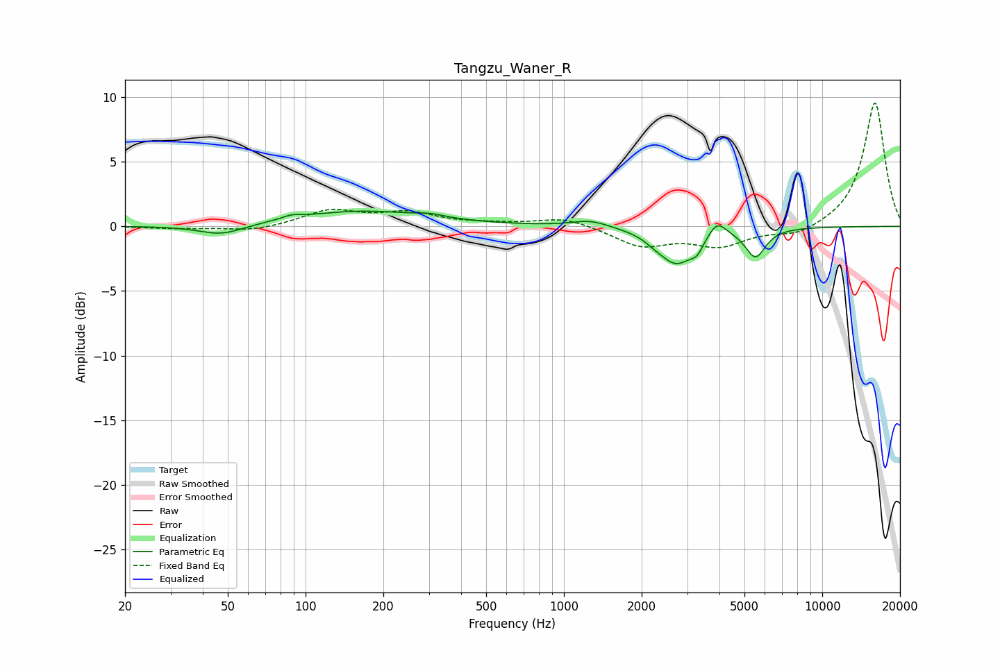

# Tangzu_Waner_R
See [usage instructions](https://github.com/jaakkopasanen/AutoEq#usage) for more options and info.

### Parametric EQs
Apply preamp of -1.3 dB when using parametric equalizer.

|   # | Type    |   Fc (Hz) |    Q |   Gain (dB) |
|-----|---------|-----------|------|-------------|
|   1 | Peaking |        47 | 1.6  |        -0.8 |
|   2 | Peaking |        88 | 4.1  |         0.3 |
|   3 | Peaking |       164 | 0.54 |         1.2 |
|   4 | Peaking |       305 | 2.71 |         0.2 |
|   5 | Peaking |      1266 | 1.97 |         0.5 |
|   6 | Peaking |      2241 | 4.12 |        -0.2 |
|   7 | Peaking |      2726 | 2.03 |        -2.8 |
|   8 | Peaking |      3278 | 6    |        -0.8 |
|   9 | Peaking |      3916 | 4.05 |         1.2 |
|  10 | Peaking |      5515 | 3.57 |        -2.2 |

### Fixed Band EQs
When using fixed band (also called graphic) equalizer, apply preamp of **-9.6 dB** (if available) and set gains manually with these parameters.

|   # | Type    |   Fc (Hz) |    Q |   Gain (dB) |
|-----|---------|-----------|------|-------------|
|   1 | Peaking |        31 | 1.41 |        -0.2 |
|   2 | Peaking |        62 | 1.41 |        -0.4 |
|   3 | Peaking |       125 | 1.41 |         1.2 |
|   4 | Peaking |       250 | 1.41 |         1   |
|   5 | Peaking |       500 | 1.41 |         0.1 |
|   6 | Peaking |      1000 | 1.41 |         0.7 |
|   7 | Peaking |      2000 | 1.41 |        -1.5 |
|   8 | Peaking |      4000 | 1.41 |        -1.4 |
|   9 | Peaking |      8000 | 1.41 |        -0.8 |
|  10 | Peaking |     16000 | 1.41 |         9.7 |

### Graphs

