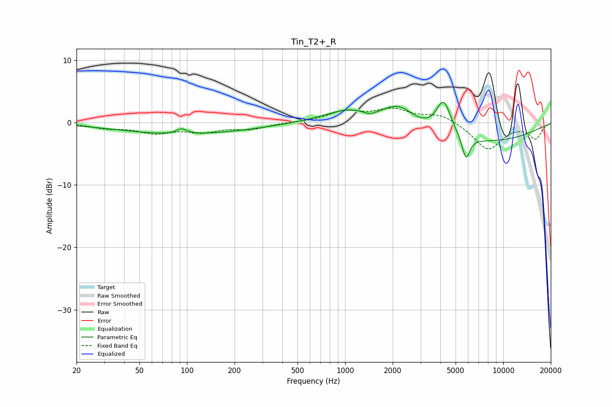

# Tin_T2+_R
See [usage instructions](https://github.com/jaakkopasanen/AutoEq#usage) for more options and info.

### Parametric EQs
Apply preamp of -3.3 dB when using parametric equalizer.

|   # | Type    |   Fc (Hz) |    Q |   Gain (dB) |
|-----|---------|-----------|------|-------------|
|   1 | Peaking |        65 | 1.16 |        -0.1 |
|   2 | Peaking |        92 | 4.41 |         0.8 |
|   3 | Peaking |        98 | 0.33 |        -1.8 |
|   4 | Peaking |       769 | 1.61 |        -0.1 |
|   5 | Peaking |      1060 | 0.86 |         2.3 |
|   6 | Peaking |      1438 | 3.19 |        -0.7 |
|   7 | Peaking |      2187 | 1.39 |         3.2 |
|   8 | Peaking |      4199 | 2.98 |         5.5 |
|   9 | Peaking |      5815 | 5.63 |        -3.8 |
|  10 | Peaking |      6758 | 0.32 |        -3.2 |

### Fixed Band EQs
When using fixed band (also called graphic) equalizer, apply preamp of **-2.4 dB** (if available) and set gains manually with these parameters.

|   # | Type    |   Fc (Hz) |    Q |   Gain (dB) |
|-----|---------|-----------|------|-------------|
|   1 | Peaking |        31 | 1.41 |        -0.8 |
|   2 | Peaking |        62 | 1.41 |        -1.5 |
|   3 | Peaking |       125 | 1.41 |        -1.3 |
|   4 | Peaking |       250 | 1.41 |        -1   |
|   5 | Peaking |       500 | 1.41 |         0   |
|   6 | Peaking |      1000 | 1.41 |         1.7 |
|   7 | Peaking |      2000 | 1.41 |         1.9 |
|   8 | Peaking |      4000 | 1.41 |         1.3 |
|   9 | Peaking |      8000 | 1.41 |        -4.3 |
|  10 | Peaking |     16000 | 1.41 |        -2.5 |

### Graphs

