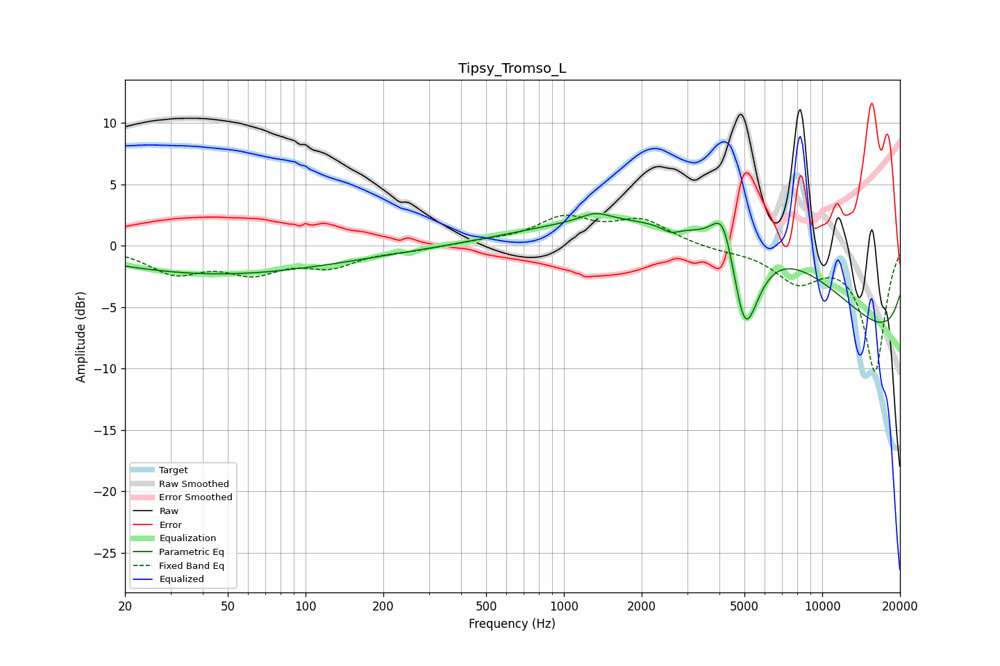

# Tipsy_Tromso_L
See [usage instructions](https://github.com/jaakkopasanen/AutoEq#usage) for more options and info.

### Parametric EQs
Apply preamp of -2.7 dB when using parametric equalizer.

|   # | Type    |   Fc (Hz) |    Q |   Gain (dB) |
|-----|---------|-----------|------|-------------|
|   1 | Peaking |        40 | 0.35 |        -1.3 |
|   2 | Peaking |        65 | 0.27 |        -1.1 |
|   3 | Peaking |      1312 | 0.45 |         1.3 |
|   4 | Peaking |      1325 | 2.56 |         0.7 |
|   5 | Peaking |      2595 | 4    |        -0.6 |
|   6 | Peaking |      4142 | 3.24 |         3.8 |
|   7 | Peaking |      5007 | 4.09 |        -1.9 |
|   8 | Peaking |      5038 | 2.21 |        -6.2 |
|   9 | Peaking |      6176 | 0.28 |        12.6 |
|  10 | Peaking |     10000 | 0.18 |       -13.6 |

### Fixed Band EQs
When using fixed band (also called graphic) equalizer, apply preamp of **-2.6 dB** (if available) and set gains manually with these parameters.

|   # | Type    |   Fc (Hz) |    Q |   Gain (dB) |
|-----|---------|-----------|------|-------------|
|   1 | Peaking |        31 | 1.41 |        -2.1 |
|   2 | Peaking |        62 | 1.41 |        -1.9 |
|   3 | Peaking |       125 | 1.41 |        -1.5 |
|   4 | Peaking |       250 | 1.41 |        -0.3 |
|   5 | Peaking |       500 | 1.41 |         0.3 |
|   6 | Peaking |      1000 | 1.41 |         2.1 |
|   7 | Peaking |      2000 | 1.41 |         2   |
|   8 | Peaking |      4000 | 1.41 |        -0.3 |
|   9 | Peaking |      8000 | 1.41 |        -2.7 |
|  10 | Peaking |     16000 | 1.41 |       -10.1 |

### Graphs

