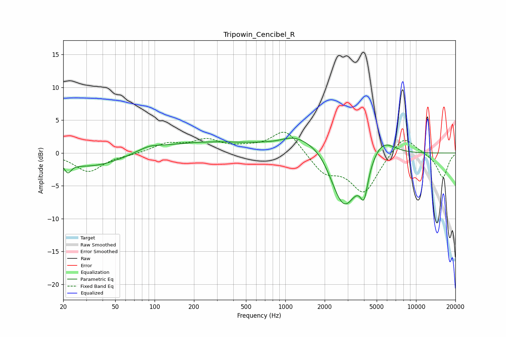

# Tripowin_Cencibel_R
See [usage instructions](https://github.com/jaakkopasanen/AutoEq#usage) for more options and info.

### Parametric EQs
Apply preamp of -2.4 dB when using parametric equalizer.

|   # | Type    |   Fc (Hz) |    Q |   Gain (dB) |
|-----|---------|-----------|------|-------------|
|   1 | Peaking |        22 | 5.68 |        -1.5 |
|   2 | Peaking |        33 | 0.6  |        -2.1 |
|   3 | Peaking |        91 | 1.57 |         0.7 |
|   4 | Peaking |       236 | 0.37 |         1.6 |
|   5 | Peaking |       877 | 1.51 |        -0.5 |
|   6 | Peaking |      1191 | 0.86 |         3   |
|   7 | Peaking |      1908 | 1.42 |         1.7 |
|   8 | Peaking |      2800 | 1.24 |        -9.5 |
|   9 | Peaking |      4003 | 4.87 |        -4.3 |
|  10 | Peaking |      5475 | 1.44 |         3.2 |

### Fixed Band EQs
When using fixed band (also called graphic) equalizer, apply preamp of **-3.3 dB** (if available) and set gains manually with these parameters.

|   # | Type    |   Fc (Hz) |    Q |   Gain (dB) |
|-----|---------|-----------|------|-------------|
|   1 | Peaking |        31 | 1.41 |        -2.8 |
|   2 | Peaking |        62 | 1.41 |        -0.2 |
|   3 | Peaking |       125 | 1.41 |         1.3 |
|   4 | Peaking |       250 | 1.41 |         1.8 |
|   5 | Peaking |       500 | 1.41 |         0.5 |
|   6 | Peaking |      1000 | 1.41 |         3.7 |
|   7 | Peaking |      2000 | 1.41 |        -2.9 |
|   8 | Peaking |      4000 | 1.41 |        -5.9 |
|   9 | Peaking |      8000 | 1.41 |         3   |
|  10 | Peaking |     16000 | 1.41 |        -3.8 |

### Graphs

