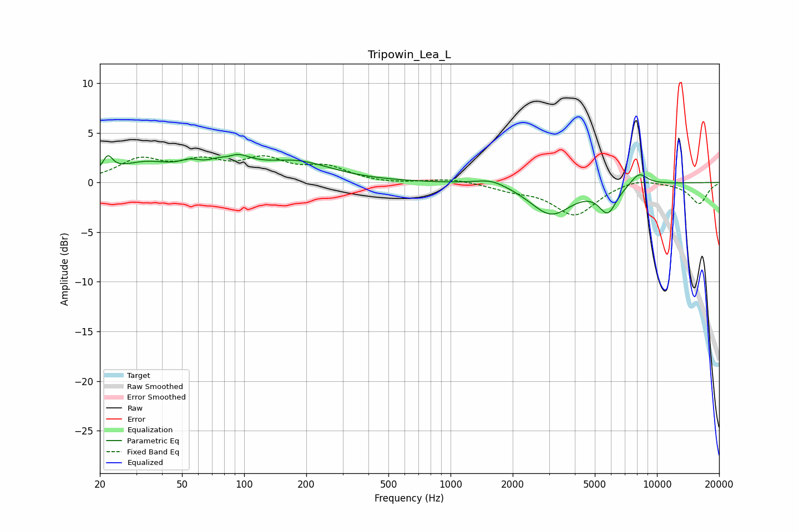

# Tripowin_Lea_L
See [usage instructions](https://github.com/jaakkopasanen/AutoEq#usage) for more options and info.

### Parametric EQs
Apply preamp of -2.9 dB when using parametric equalizer.

|   # | Type    |   Fc (Hz) |    Q |   Gain (dB) |
|-----|---------|-----------|------|-------------|
|   1 | Peaking |        22 | 6    |         1.6 |
|   2 | Peaking |        33 | 1.02 |         1.8 |
|   3 | Peaking |        55 | 2.84 |         0.7 |
|   4 | Peaking |        84 | 3.19 |        -1.2 |
|   5 | Peaking |        86 | 1.92 |         2.7 |
|   6 | Peaking |       179 | 0.82 |         1.9 |
|   7 | Peaking |      1577 | 1.83 |         0.7 |
|   8 | Peaking |      3067 | 1.39 |        -3.2 |
|   9 | Peaking |      5777 | 3.23 |        -2.6 |
|  10 | Peaking |      8180 | 3.19 |         1.3 |

### Fixed Band EQs
When using fixed band (also called graphic) equalizer, apply preamp of **-2.8 dB** (if available) and set gains manually with these parameters.

|   # | Type    |   Fc (Hz) |    Q |   Gain (dB) |
|-----|---------|-----------|------|-------------|
|   1 | Peaking |        31 | 1.41 |         2.1 |
|   2 | Peaking |        62 | 1.41 |         1.8 |
|   3 | Peaking |       125 | 1.41 |         2   |
|   4 | Peaking |       250 | 1.41 |         1.4 |
|   5 | Peaking |       500 | 1.41 |        -0.2 |
|   6 | Peaking |      1000 | 1.41 |         0.4 |
|   7 | Peaking |      2000 | 1.41 |        -0.6 |
|   8 | Peaking |      4000 | 1.41 |        -3.2 |
|   9 | Peaking |      8000 | 1.41 |         0.6 |
|  10 | Peaking |     16000 | 1.41 |        -2.1 |

### Graphs

