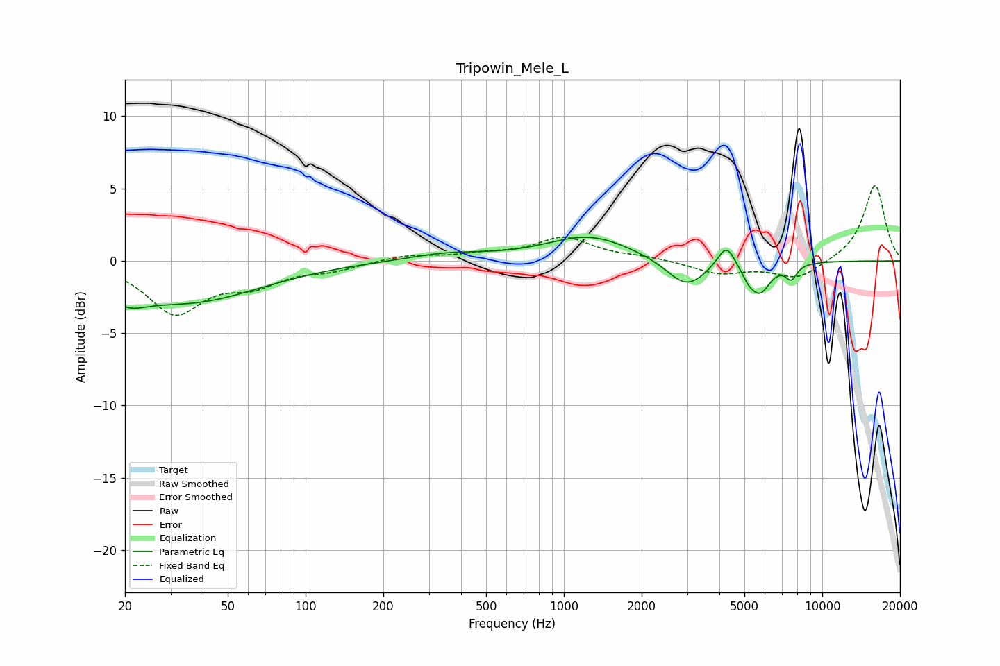

# Tripowin_Mele_L
See [usage instructions](https://github.com/jaakkopasanen/AutoEq#usage) for more options and info.

### Parametric EQs
Apply preamp of -1.7 dB when using parametric equalizer.

|   # | Type    |   Fc (Hz) |    Q |   Gain (dB) |
|-----|---------|-----------|------|-------------|
|   1 | Peaking |        20 | 1.99 |        -1.1 |
|   2 | Peaking |        35 | 0.5  |        -2.8 |
|   3 | Peaking |       353 | 0.96 |         0.5 |
|   4 | Peaking |      1255 | 0.86 |         1.7 |
|   5 | Peaking |      2981 | 1.82 |        -2   |
|   6 | Peaking |      4261 | 4    |         1.7 |
|   7 | Peaking |      4884 | 4.19 |        -0.2 |
|   8 | Peaking |      5213 | 5.99 |        -0.5 |
|   9 | Peaking |      5744 | 3.44 |        -2   |
|  10 | Peaking |      7587 | 6    |        -1   |

### Fixed Band EQs
When using fixed band (also called graphic) equalizer, apply preamp of **-5.3 dB** (if available) and set gains manually with these parameters.

|   # | Type    |   Fc (Hz) |    Q |   Gain (dB) |
|-----|---------|-----------|------|-------------|
|   1 | Peaking |        31 | 1.41 |        -3.5 |
|   2 | Peaking |        62 | 1.41 |        -1.4 |
|   3 | Peaking |       125 | 1.41 |        -0.5 |
|   4 | Peaking |       250 | 1.41 |         0.4 |
|   5 | Peaking |       500 | 1.41 |         0.4 |
|   6 | Peaking |      1000 | 1.41 |         1.6 |
|   7 | Peaking |      2000 | 1.41 |         0.2 |
|   8 | Peaking |      4000 | 1.41 |        -0.9 |
|   9 | Peaking |      8000 | 1.41 |        -1.2 |
|  10 | Peaking |     16000 | 1.41 |         5.3 |

### Graphs

