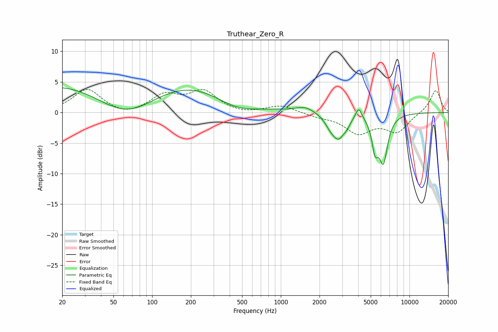

# Truthear_Zero_R
See [usage instructions](https://github.com/jaakkopasanen/AutoEq#usage) for more options and info.

### Parametric EQs
Apply preamp of -4.1 dB when using parametric equalizer.

|   # | Type    |   Fc (Hz) |    Q |   Gain (dB) |
|-----|---------|-----------|------|-------------|
|   1 | Peaking |        63 | 0.42 |       -11.3 |
|   2 | Peaking |        67 | 0.18 |        11.9 |
|   3 | Peaking |       443 | 0.76 |        -2.7 |
|   4 | Peaking |      1545 | 2.09 |         0.9 |
|   5 | Peaking |      2443 | 3.11 |        -1.7 |
|   6 | Peaking |      2820 | 3.2  |        -3.2 |
|   7 | Peaking |      3252 | 4.96 |        -0.9 |
|   8 | Peaking |      4032 | 5.74 |         1.9 |
|   9 | Peaking |      5402 | 5.58 |        -4.5 |
|  10 | Peaking |      6265 | 4.04 |        -7.4 |

### Fixed Band EQs
When using fixed band (also called graphic) equalizer, apply preamp of **-3.9 dB** (if available) and set gains manually with these parameters.

|   # | Type    |   Fc (Hz) |    Q |   Gain (dB) |
|-----|---------|-----------|------|-------------|
|   1 | Peaking |        31 | 1.41 |         3.8 |
|   2 | Peaking |        62 | 1.41 |        -0.8 |
|   3 | Peaking |       125 | 1.41 |         2.7 |
|   4 | Peaking |       250 | 1.41 |         3.3 |
|   5 | Peaking |       500 | 1.41 |        -0.3 |
|   6 | Peaking |      1000 | 1.41 |         1.2 |
|   7 | Peaking |      2000 | 1.41 |        -0.5 |
|   8 | Peaking |      4000 | 1.41 |        -3.2 |
|   9 | Peaking |      8000 | 1.41 |        -3   |
|  10 | Peaking |     16000 | 1.41 |         3.7 |

### Graphs

