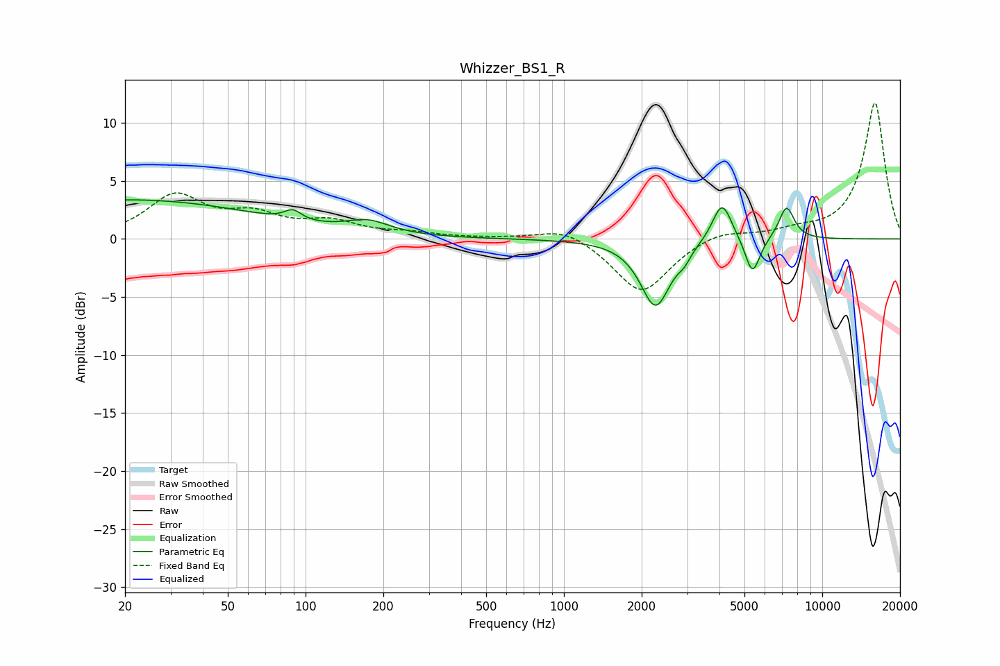

# Whizzer_BS1_R
See [usage instructions](https://github.com/jaakkopasanen/AutoEq#usage) for more options and info.

### Parametric EQs
Apply preamp of -3.5 dB when using parametric equalizer.

|   # | Type    |   Fc (Hz) |    Q |   Gain (dB) |
|-----|---------|-----------|------|-------------|
|   1 | Peaking |        20 | 0.27 |         3.4 |
|   2 | Peaking |        89 | 4.46 |         0.9 |
|   3 | Peaking |       175 | 1.68 |         1.1 |
|   4 | Peaking |      2264 | 2.44 |        -5.8 |
|   5 | Peaking |      2923 | 5.96 |        -1.1 |
|   6 | Peaking |      2926 | 6    |         0.5 |
|   7 | Peaking |      4096 | 3.69 |         3.6 |
|   8 | Peaking |      5368 | 4.89 |        -3.2 |
|   9 | Peaking |      5487 | 3.6  |        -0.1 |
|  10 | Peaking |      7276 | 4.49 |         2.9 |

### Fixed Band EQs
When using fixed band (also called graphic) equalizer, apply preamp of **-11.8 dB** (if available) and set gains manually with these parameters.

|   # | Type    |   Fc (Hz) |    Q |   Gain (dB) |
|-----|---------|-----------|------|-------------|
|   1 | Peaking |        31 | 1.41 |         3.6 |
|   2 | Peaking |        62 | 1.41 |         1.7 |
|   3 | Peaking |       125 | 1.41 |         1.3 |
|   4 | Peaking |       250 | 1.41 |         0.4 |
|   5 | Peaking |       500 | 1.41 |         0   |
|   6 | Peaking |      1000 | 1.41 |         1.1 |
|   7 | Peaking |      2000 | 1.41 |        -4.7 |
|   8 | Peaking |      4000 | 1.41 |         0.8 |
|   9 | Peaking |      8000 | 1.41 |         0.6 |
|  10 | Peaking |     16000 | 1.41 |        11.8 |

### Graphs

