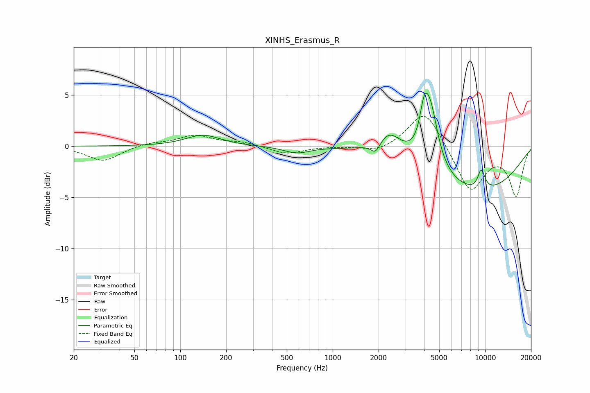

# XINHS_Erasmus_R
See [usage instructions](https://github.com/jaakkopasanen/AutoEq#usage) for more options and info.

### Parametric EQs
Apply preamp of -5.3 dB when using parametric equalizer.

|   # | Type    |   Fc (Hz) |    Q |   Gain (dB) |
|-----|---------|-----------|------|-------------|
|   1 | Peaking |       141 | 1.25 |         1.1 |
|   2 | Peaking |       581 | 1.66 |        -0.6 |
|   3 | Peaking |      1913 | 4.6  |        -1.1 |
|   4 | Peaking |      2352 | 1.78 |         2.2 |
|   5 | Peaking |      3961 | 5.84 |         1.4 |
|   6 | Peaking |      4038 | 4.12 |         1.7 |
|   7 | Peaking |      4378 | 2.76 |         5.6 |
|   8 | Peaking |      8736 | 0.38 |        -4.5 |
|   9 | Peaking |      9376 | 5.92 |         1.6 |
|  10 | Peaking |      9820 | 5.83 |         0.4 |

### Fixed Band EQs
When using fixed band (also called graphic) equalizer, apply preamp of **-3.0 dB** (if available) and set gains manually with these parameters.

|   # | Type    |   Fc (Hz) |    Q |   Gain (dB) |
|-----|---------|-----------|------|-------------|
|   1 | Peaking |        31 | 1.41 |        -1.5 |
|   2 | Peaking |        62 | 1.41 |         0.3 |
|   3 | Peaking |       125 | 1.41 |         1   |
|   4 | Peaking |       250 | 1.41 |         0.4 |
|   5 | Peaking |       500 | 1.41 |        -0.8 |
|   6 | Peaking |      1000 | 1.41 |         0   |
|   7 | Peaking |      2000 | 1.41 |        -0.6 |
|   8 | Peaking |      4000 | 1.41 |         3.7 |
|   9 | Peaking |      8000 | 1.41 |        -4.4 |
|  10 | Peaking |     16000 | 1.41 |        -4.7 |

### Graphs

