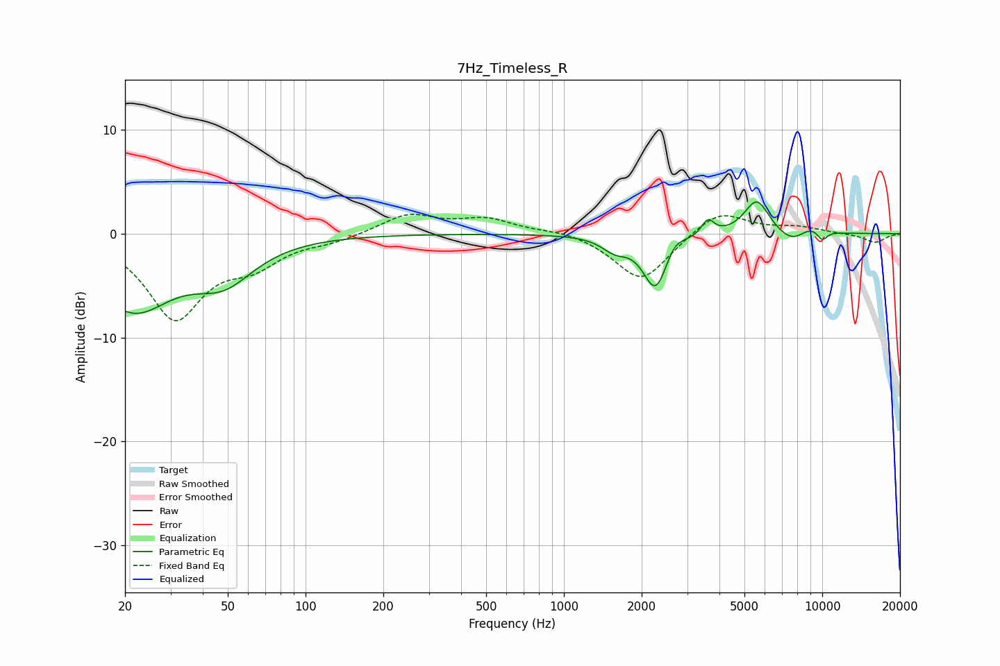

# 7Hz_Timeless_R
See [usage instructions](https://github.com/jaakkopasanen/AutoEq#usage) for more options and info.

### Parametric EQs
Apply preamp of -3.1 dB when using parametric equalizer.

|   # | Type    |   Fc (Hz) |    Q |   Gain (dB) |
|-----|---------|-----------|------|-------------|
|   1 | Peaking |        21 | 0.9  |        -7   |
|   2 | Peaking |        48 | 1.2  |        -3.5 |
|   3 | Peaking |      1573 | 2.85 |        -1.2 |
|   4 | Peaking |      2265 | 2.94 |        -5.3 |
|   5 | Peaking |      2668 | 4.08 |         1.1 |
|   6 | Peaking |      3611 | 5.96 |         1.5 |
|   7 | Peaking |      5582 | 2.82 |         3.4 |
|   8 | Peaking |      7750 | 2.05 |        -1.5 |
|   9 | Peaking |      8898 | 2.13 |         1.2 |
|  10 | Peaking |     10000 | 5.98 |        -1   |

### Fixed Band EQs
When using fixed band (also called graphic) equalizer, apply preamp of **-2.0 dB** (if available) and set gains manually with these parameters.

|   # | Type    |   Fc (Hz) |    Q |   Gain (dB) |
|-----|---------|-----------|------|-------------|
|   1 | Peaking |        31 | 1.41 |        -7.9 |
|   2 | Peaking |        62 | 1.41 |        -2.4 |
|   3 | Peaking |       125 | 1.41 |        -0.6 |
|   4 | Peaking |       250 | 1.41 |         1.9 |
|   5 | Peaking |       500 | 1.41 |         1.3 |
|   6 | Peaking |      1000 | 1.41 |         0.4 |
|   7 | Peaking |      2000 | 1.41 |        -4.7 |
|   8 | Peaking |      4000 | 1.41 |         2.4 |
|   9 | Peaking |      8000 | 1.41 |         0.6 |
|  10 | Peaking |     16000 | 1.41 |        -0.9 |

### Graphs

