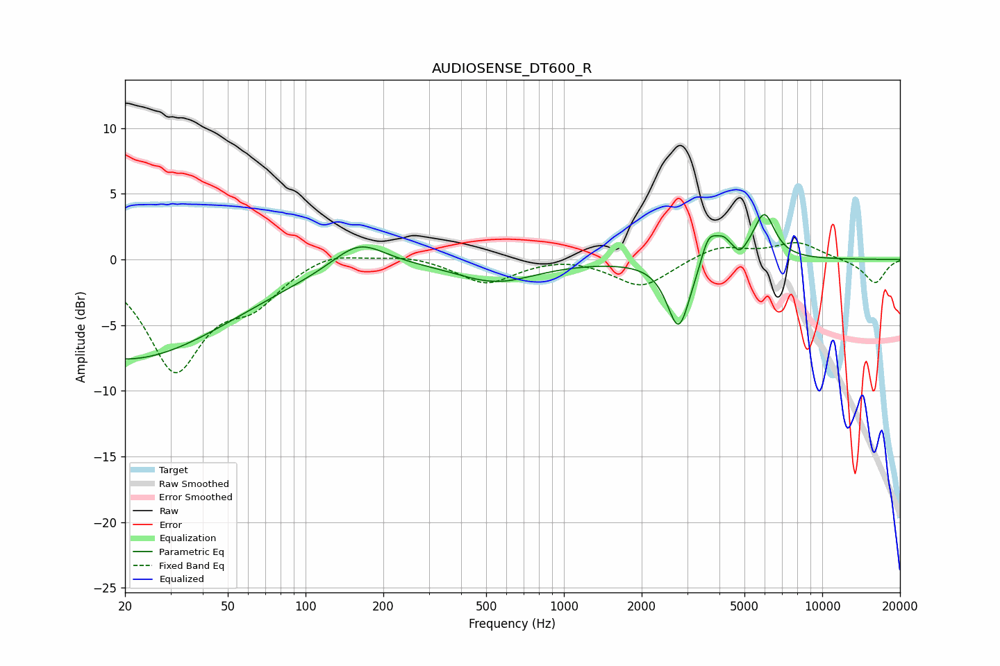

# AUDIOSENSE_DT600_R
See [usage instructions](https://github.com/jaakkopasanen/AutoEq#usage) for more options and info.

### Parametric EQs
Apply preamp of -3.5 dB when using parametric equalizer.

|   # | Type    |   Fc (Hz) |    Q |   Gain (dB) |
|-----|---------|-----------|------|-------------|
|   1 | Peaking |        20 | 0.35 |        -7.6 |
|   2 | Peaking |       161 | 1.39 |         2.1 |
|   3 | Peaking |       546 | 0.91 |        -1.7 |
|   4 | Peaking |      2782 | 3.19 |        -5.3 |
|   5 | Peaking |      3548 | 6    |         0.7 |
|   6 | Peaking |      3690 | 4.83 |         1.3 |
|   7 | Peaking |      4258 | 3.73 |         2.4 |
|   8 | Peaking |      4344 | 5.35 |        -1   |
|   9 | Peaking |      4785 | 5.61 |        -0.9 |
|  10 | Peaking |      5965 | 3.36 |         3.4 |

### Fixed Band EQs
When using fixed band (also called graphic) equalizer, apply preamp of **-1.4 dB** (if available) and set gains manually with these parameters.

|   # | Type    |   Fc (Hz) |    Q |   Gain (dB) |
|-----|---------|-----------|------|-------------|
|   1 | Peaking |        31 | 1.41 |        -8.2 |
|   2 | Peaking |        62 | 1.41 |        -2.7 |
|   3 | Peaking |       125 | 1.41 |         0.8 |
|   4 | Peaking |       250 | 1.41 |         0.4 |
|   5 | Peaking |       500 | 1.41 |        -1.8 |
|   6 | Peaking |      1000 | 1.41 |         0.3 |
|   7 | Peaking |      2000 | 1.41 |        -2.1 |
|   8 | Peaking |      4000 | 1.41 |         1.1 |
|   9 | Peaking |      8000 | 1.41 |         1.3 |
|  10 | Peaking |     16000 | 1.41 |        -1.8 |

### Graphs

