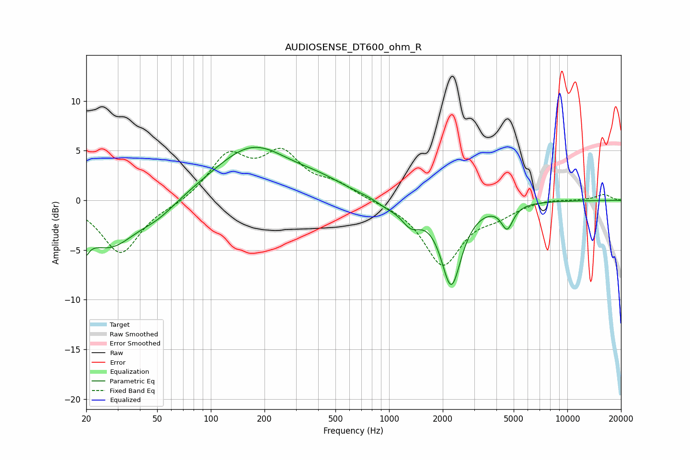

# AUDIOSENSE_DT600_ohm_R
See [usage instructions](https://github.com/jaakkopasanen/AutoEq#usage) for more options and info.

### Parametric EQs
Apply preamp of -5.4 dB when using parametric equalizer.

|   # | Type    |   Fc (Hz) |    Q |   Gain (dB) |
|-----|---------|-----------|------|-------------|
|   1 | Peaking |        20 | 5.64 |        -5.3 |
|   2 | Peaking |        20 | 5.99 |         3.2 |
|   3 | Peaking |        27 | 0.93 |        -4.6 |
|   4 | Peaking |        51 | 1.31 |        -1.2 |
|   5 | Peaking |       171 | 0.65 |         5.4 |
|   6 | Peaking |       414 | 1.02 |         0.9 |
|   7 | Peaking |       967 | 2.44 |        -0.5 |
|   8 | Peaking |      1324 | 2.51 |        -1.9 |
|   9 | Peaking |      2232 | 2.47 |        -8.3 |
|  10 | Peaking |      4597 | 4.25 |        -2.4 |

### Fixed Band EQs
When using fixed band (also called graphic) equalizer, apply preamp of **-5.3 dB** (if available) and set gains manually with these parameters.

|   # | Type    |   Fc (Hz) |    Q |   Gain (dB) |
|-----|---------|-----------|------|-------------|
|   1 | Peaking |        31 | 1.41 |        -5.4 |
|   2 | Peaking |        62 | 1.41 |        -0.4 |
|   3 | Peaking |       125 | 1.41 |         4.3 |
|   4 | Peaking |       250 | 1.41 |         4.3 |
|   5 | Peaking |       500 | 1.41 |         1.4 |
|   6 | Peaking |      1000 | 1.41 |        -0.1 |
|   7 | Peaking |      2000 | 1.41 |        -6.4 |
|   8 | Peaking |      4000 | 1.41 |        -1.1 |
|   9 | Peaking |      8000 | 1.41 |         0.2 |
|  10 | Peaking |     16000 | 1.41 |         0.6 |

### Graphs

