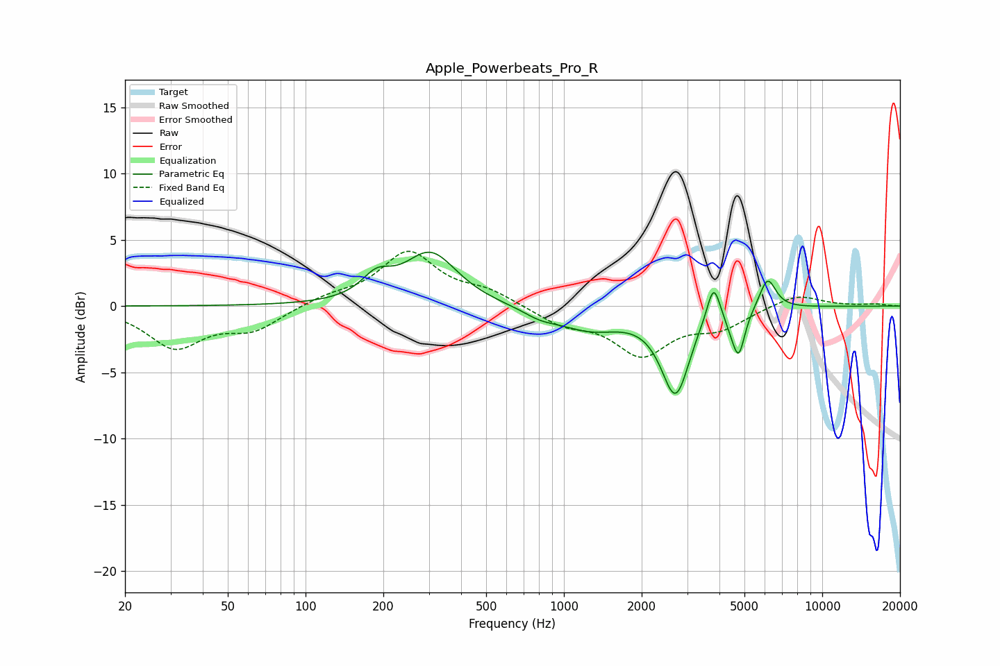

# Apple_Powerbeats_Pro_R
See [usage instructions](https://github.com/jaakkopasanen/AutoEq#usage) for more options and info.

### Parametric EQs
Apply preamp of -4.2 dB when using parametric equalizer.

|   # | Type    |   Fc (Hz) |    Q |   Gain (dB) |
|-----|---------|-----------|------|-------------|
|   1 | Peaking |       188 | 2.48 |         1.6 |
|   2 | Peaking |       305 | 1.39 |         4   |
|   3 | Peaking |       809 | 2.17 |        -0.5 |
|   4 | Peaking |      1257 | 1.11 |        -1.6 |
|   5 | Peaking |      2711 | 2.53 |        -6.6 |
|   6 | Peaking |      3280 | 2.24 |         0.5 |
|   7 | Peaking |      3800 | 5.47 |         3   |
|   8 | Peaking |      4466 | 4.27 |        -0.8 |
|   9 | Peaking |      4753 | 5.98 |        -3   |
|  10 | Peaking |      6143 | 4.31 |         2.4 |

### Fixed Band EQs
When using fixed band (also called graphic) equalizer, apply preamp of **-4.2 dB** (if available) and set gains manually with these parameters.

|   # | Type    |   Fc (Hz) |    Q |   Gain (dB) |
|-----|---------|-----------|------|-------------|
|   1 | Peaking |        31 | 1.41 |        -3   |
|   2 | Peaking |        62 | 1.41 |        -1.7 |
|   3 | Peaking |       125 | 1.41 |         0.6 |
|   4 | Peaking |       250 | 1.41 |         4   |
|   5 | Peaking |       500 | 1.41 |         1   |
|   6 | Peaking |      1000 | 1.41 |        -1.2 |
|   7 | Peaking |      2000 | 1.41 |        -3.5 |
|   8 | Peaking |      4000 | 1.41 |        -1.4 |
|   9 | Peaking |      8000 | 1.41 |         1   |
|  10 | Peaking |     16000 | 1.41 |         0.1 |

### Graphs

