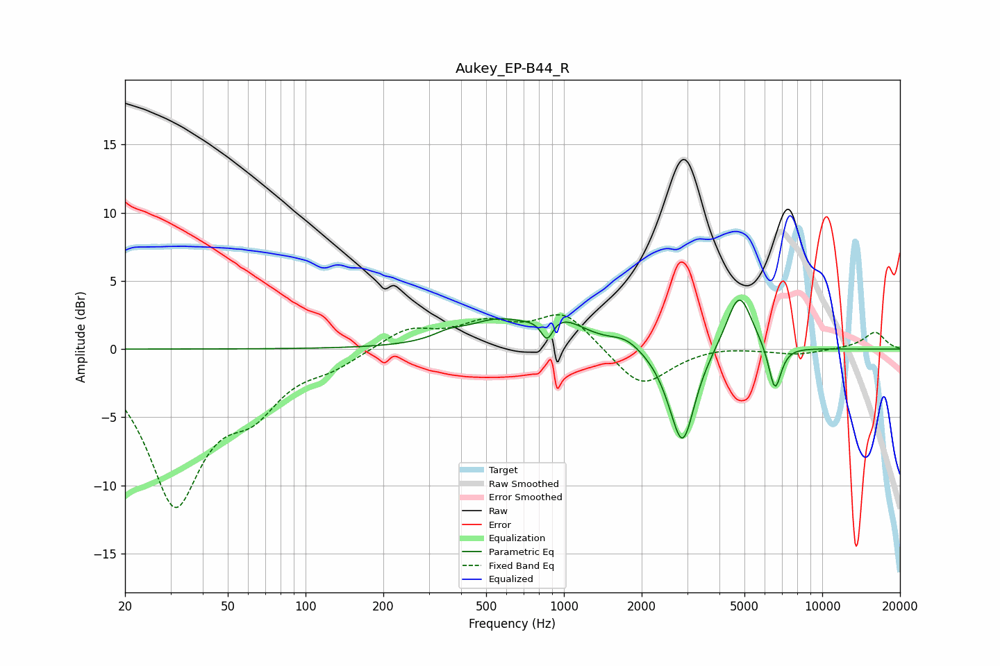

# Aukey_EP-B44_R
See [usage instructions](https://github.com/jaakkopasanen/AutoEq#usage) for more options and info.

### Parametric EQs
Apply preamp of -3.7 dB when using parametric equalizer.

|   # | Type    |   Fc (Hz) |    Q |   Gain (dB) |
|-----|---------|-----------|------|-------------|
|   1 | Peaking |       359 | 2.37 |         0.5 |
|   2 | Peaking |       577 | 1.1  |         2   |
|   3 | Peaking |       664 | 1.81 |        -0.4 |
|   4 | Peaking |       861 | 6    |        -1.7 |
|   5 | Peaking |       961 | 1.46 |         1.7 |
|   6 | Peaking |      1735 | 2.39 |         0.7 |
|   7 | Peaking |      2641 | 2.46 |        -0.9 |
|   8 | Peaking |      2889 | 3.02 |        -6.5 |
|   9 | Peaking |      4769 | 2.77 |         4.4 |
|  10 | Peaking |      6558 | 5.53 |        -3.4 |

### Fixed Band EQs
When using fixed band (also called graphic) equalizer, apply preamp of **-2.6 dB** (if available) and set gains manually with these parameters.

|   # | Type    |   Fc (Hz) |    Q |   Gain (dB) |
|-----|---------|-----------|------|-------------|
|   1 | Peaking |        31 | 1.41 |       -11   |
|   2 | Peaking |        62 | 1.41 |        -3.3 |
|   3 | Peaking |       125 | 1.41 |        -1   |
|   4 | Peaking |       250 | 1.41 |         1.5 |
|   5 | Peaking |       500 | 1.41 |         1.7 |
|   6 | Peaking |      1000 | 1.41 |         2.6 |
|   7 | Peaking |      2000 | 1.41 |        -2.9 |
|   8 | Peaking |      4000 | 1.41 |         0.3 |
|   9 | Peaking |      8000 | 1.41 |        -0.4 |
|  10 | Peaking |     16000 | 1.41 |         1.3 |

### Graphs

