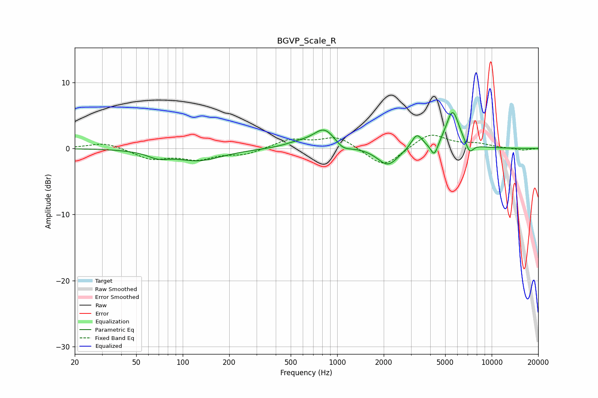

# BGVP_Scale_R
See [usage instructions](https://github.com/jaakkopasanen/AutoEq#usage) for more options and info.

### Parametric EQs
Apply preamp of -5.5 dB when using parametric equalizer.

|   # | Type    |   Fc (Hz) |    Q |   Gain (dB) |
|-----|---------|-----------|------|-------------|
|   1 | Peaking |        69 | 2.06 |        -0.9 |
|   2 | Peaking |       127 | 0.93 |        -1.8 |
|   3 | Peaking |       556 | 1.57 |         0.6 |
|   4 | Peaking |       829 | 1.96 |         2.9 |
|   5 | Peaking |      1086 | 2.92 |        -1   |
|   6 | Peaking |      2128 | 2.12 |        -2.7 |
|   7 | Peaking |      3276 | 4.01 |         2.2 |
|   8 | Peaking |      4252 | 6    |        -2.1 |
|   9 | Peaking |      5585 | 3.17 |         5.7 |
|  10 | Peaking |      7194 | 5.64 |        -1.6 |

### Fixed Band EQs
When using fixed band (also called graphic) equalizer, apply preamp of **-2.1 dB** (if available) and set gains manually with these parameters.

|   # | Type    |   Fc (Hz) |    Q |   Gain (dB) |
|-----|---------|-----------|------|-------------|
|   1 | Peaking |        31 | 1.41 |         1   |
|   2 | Peaking |        62 | 1.41 |        -1.5 |
|   3 | Peaking |       125 | 1.41 |        -1.5 |
|   4 | Peaking |       250 | 1.41 |        -0.9 |
|   5 | Peaking |       500 | 1.41 |         1.4 |
|   6 | Peaking |      1000 | 1.41 |         1.8 |
|   7 | Peaking |      2000 | 1.41 |        -3   |
|   8 | Peaking |      4000 | 1.41 |         2.3 |
|   9 | Peaking |      8000 | 1.41 |         0.6 |
|  10 | Peaking |     16000 | 1.41 |        -0.3 |

### Graphs

