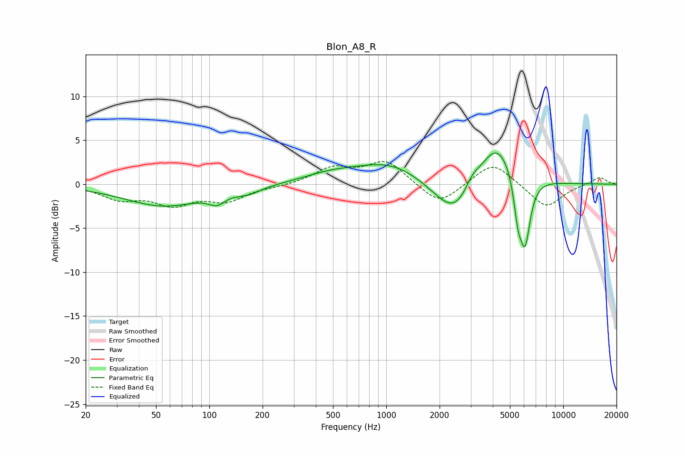

# Blon_A8_R
See [usage instructions](https://github.com/jaakkopasanen/AutoEq#usage) for more options and info.

### Parametric EQs
Apply preamp of -3.6 dB when using parametric equalizer.

|   # | Type    |   Fc (Hz) |    Q |   Gain (dB) |
|-----|---------|-----------|------|-------------|
|   1 | Peaking |        55 | 0.63 |        -2.4 |
|   2 | Peaking |       110 | 3.16 |        -1.1 |
|   3 | Peaking |       166 | 2.01 |        -0.7 |
|   4 | Peaking |       486 | 0.91 |         0.9 |
|   5 | Peaking |      1062 | 0.73 |         2.5 |
|   6 | Peaking |      2501 | 1.14 |        -5   |
|   7 | Peaking |      3046 | 3.05 |         1.6 |
|   8 | Peaking |      4190 | 1.35 |         5.7 |
|   9 | Peaking |      5539 | 5.94 |        -3.9 |
|  10 | Peaking |      6089 | 4.54 |        -7.5 |

### Fixed Band EQs
When using fixed band (also called graphic) equalizer, apply preamp of **-2.7 dB** (if available) and set gains manually with these parameters.

|   # | Type    |   Fc (Hz) |    Q |   Gain (dB) |
|-----|---------|-----------|------|-------------|
|   1 | Peaking |        31 | 1.41 |        -1.5 |
|   2 | Peaking |        62 | 1.41 |        -2.1 |
|   3 | Peaking |       125 | 1.41 |        -1.7 |
|   4 | Peaking |       250 | 1.41 |        -0.2 |
|   5 | Peaking |       500 | 1.41 |         1.8 |
|   6 | Peaking |      1000 | 1.41 |         2.6 |
|   7 | Peaking |      2000 | 1.41 |        -2.5 |
|   8 | Peaking |      4000 | 1.41 |         2.6 |
|   9 | Peaking |      8000 | 1.41 |        -2.7 |
|  10 | Peaking |     16000 | 1.41 |         0.9 |

### Graphs

