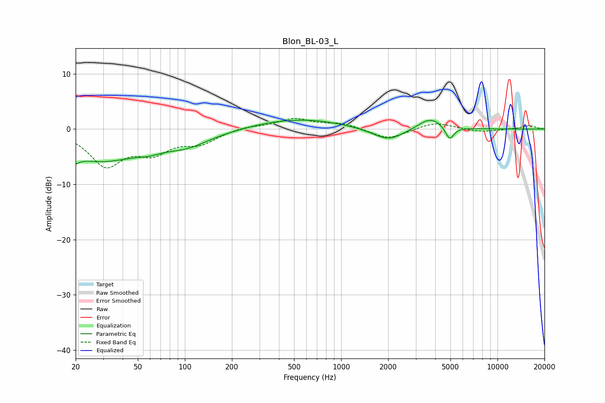

# Blon_BL-03_L
See [usage instructions](https://github.com/jaakkopasanen/AutoEq#usage) for more options and info.

### Parametric EQs
Apply preamp of -1.7 dB when using parametric equalizer.

|   # | Type    |   Fc (Hz) |    Q |   Gain (dB) |
|-----|---------|-----------|------|-------------|
|   1 | Peaking |        20 | 5.45 |        -4.7 |
|   2 | Peaking |        20 | 5.82 |         3.3 |
|   3 | Peaking |        29 | 0.53 |        -5.5 |
|   4 | Peaking |        59 | 1.92 |        -0.7 |
|   5 | Peaking |       103 | 0.96 |        -2.2 |
|   6 | Peaking |       348 | 0.85 |         0.6 |
|   7 | Peaking |       637 | 0.63 |         1.5 |
|   8 | Peaking |      2007 | 1.43 |        -2.3 |
|   9 | Peaking |      3730 | 1.82 |         2.2 |
|  10 | Peaking |      4944 | 5.1  |        -2.4 |

### Fixed Band EQs
When using fixed band (also called graphic) equalizer, apply preamp of **-2.0 dB** (if available) and set gains manually with these parameters.

|   # | Type    |   Fc (Hz) |    Q |   Gain (dB) |
|-----|---------|-----------|------|-------------|
|   1 | Peaking |        31 | 1.41 |        -6.3 |
|   2 | Peaking |        62 | 1.41 |        -3.6 |
|   3 | Peaking |       125 | 1.41 |        -2.3 |
|   4 | Peaking |       250 | 1.41 |         0.5 |
|   5 | Peaking |       500 | 1.41 |         1.8 |
|   6 | Peaking |      1000 | 1.41 |         1   |
|   7 | Peaking |      2000 | 1.41 |        -1.9 |
|   8 | Peaking |      4000 | 1.41 |         1.3 |
|   9 | Peaking |      8000 | 1.41 |        -0.6 |
|  10 | Peaking |     16000 | 1.41 |         0.7 |

### Graphs

