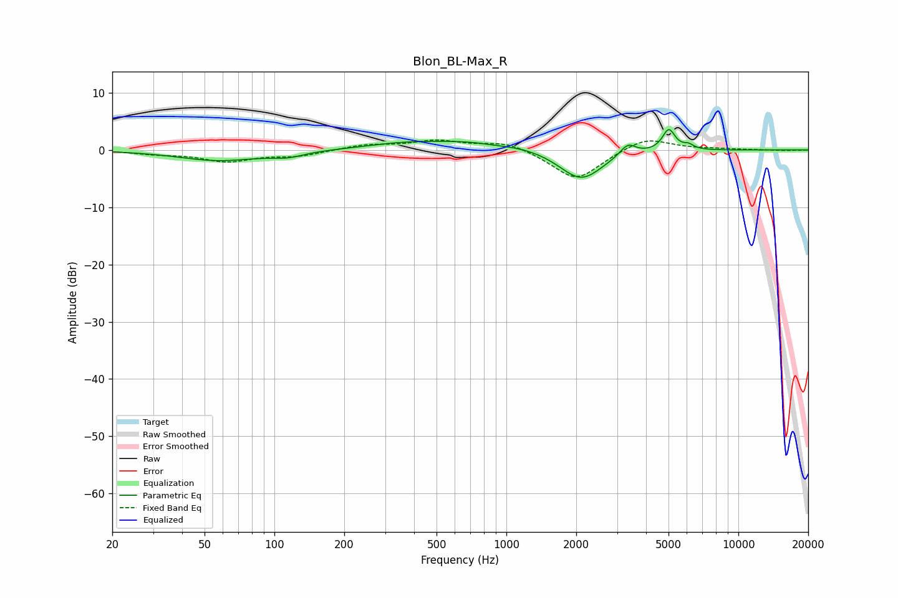

# Blon_BL-Max_R
See [usage instructions](https://github.com/jaakkopasanen/AutoEq#usage) for more options and info.

### Parametric EQs
Apply preamp of -3.7 dB when using parametric equalizer.

|   # | Type    |   Fc (Hz) |    Q |   Gain (dB) |
|-----|---------|-----------|------|-------------|
|   1 | Peaking |        58 | 0.81 |        -1.8 |
|   2 | Peaking |       114 | 1.96 |        -0.9 |
|   3 | Peaking |       340 | 1.19 |         0.3 |
|   4 | Peaking |       690 | 0.47 |         1.7 |
|   5 | Peaking |       894 | 2.31 |        -0.2 |
|   6 | Peaking |      1948 | 1.43 |        -0.8 |
|   7 | Peaking |      2116 | 1.53 |        -4.7 |
|   8 | Peaking |      3336 | 4.21 |         2   |
|   9 | Peaking |      5012 | 5.12 |         3.7 |
|  10 | Peaking |      6097 | 6    |         0.8 |

### Fixed Band EQs
When using fixed band (also called graphic) equalizer, apply preamp of **-1.8 dB** (if available) and set gains manually with these parameters.

|   # | Type    |   Fc (Hz) |    Q |   Gain (dB) |
|-----|---------|-----------|------|-------------|
|   1 | Peaking |        31 | 1.41 |        -0.6 |
|   2 | Peaking |        62 | 1.41 |        -1.9 |
|   3 | Peaking |       125 | 1.41 |        -1   |
|   4 | Peaking |       250 | 1.41 |         0.9 |
|   5 | Peaking |       500 | 1.41 |         1.5 |
|   6 | Peaking |      1000 | 1.41 |         1.5 |
|   7 | Peaking |      2000 | 1.41 |        -5.4 |
|   8 | Peaking |      4000 | 1.41 |         2.4 |
|   9 | Peaking |      8000 | 1.41 |         0.2 |
|  10 | Peaking |     16000 | 1.41 |        -0.1 |

### Graphs

