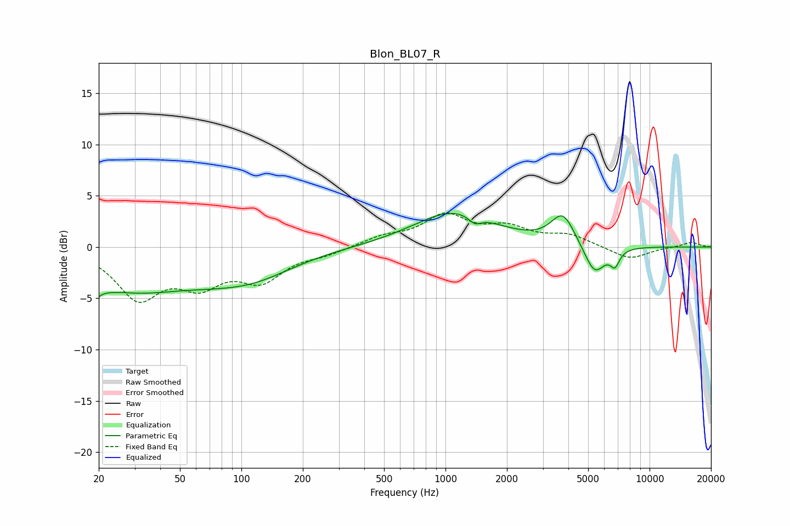

# Blon_BL07_R
See [usage instructions](https://github.com/jaakkopasanen/AutoEq#usage) for more options and info.

### Parametric EQs
Apply preamp of -3.4 dB when using parametric equalizer.

|   # | Type    |   Fc (Hz) |    Q |   Gain (dB) |
|-----|---------|-----------|------|-------------|
|   1 | Peaking |        20 | 5.29 |        -4.2 |
|   2 | Peaking |        20 | 5.67 |         3.2 |
|   3 | Peaking |        33 | 0.37 |        -4.4 |
|   4 | Peaking |        48 | 1.06 |         0.3 |
|   5 | Peaking |       116 | 0.71 |        -1.8 |
|   6 | Peaking |      1108 | 0.71 |         3.4 |
|   7 | Peaking |      1395 | 4.45 |        -0.8 |
|   8 | Peaking |      3760 | 2.43 |         3   |
|   9 | Peaking |      5379 | 2.7  |        -3   |
|  10 | Peaking |      6764 | 6    |        -1.5 |

### Fixed Band EQs
When using fixed band (also called graphic) equalizer, apply preamp of **-3.4 dB** (if available) and set gains manually with these parameters.

|   # | Type    |   Fc (Hz) |    Q |   Gain (dB) |
|-----|---------|-----------|------|-------------|
|   1 | Peaking |        31 | 1.41 |        -4.7 |
|   2 | Peaking |        62 | 1.41 |        -3.1 |
|   3 | Peaking |       125 | 1.41 |        -2.9 |
|   4 | Peaking |       250 | 1.41 |        -0.6 |
|   5 | Peaking |       500 | 1.41 |         0.9 |
|   6 | Peaking |      1000 | 1.41 |         2.9 |
|   7 | Peaking |      2000 | 1.41 |         1.6 |
|   8 | Peaking |      4000 | 1.41 |         1.1 |
|   9 | Peaking |      8000 | 1.41 |        -1.2 |
|  10 | Peaking |     16000 | 1.41 |         0.5 |

### Graphs

