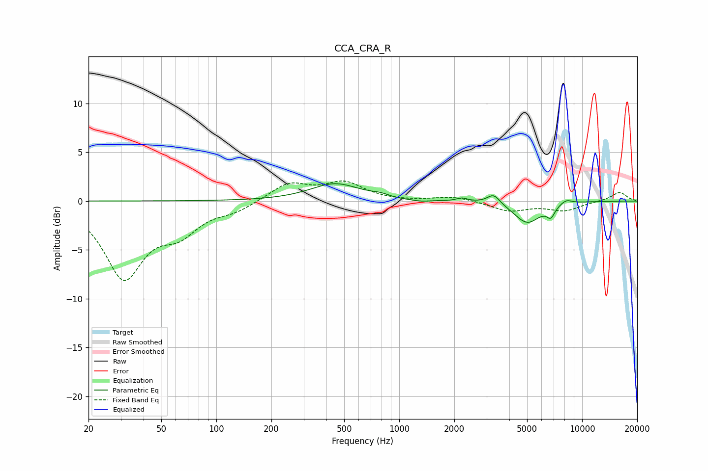

# CCA_CRA_R
See [usage instructions](https://github.com/jaakkopasanen/AutoEq#usage) for more options and info.

### Parametric EQs
Apply preamp of -1.9 dB when using parametric equalizer.

|   # | Type    |   Fc (Hz) |    Q |   Gain (dB) |
|-----|---------|-----------|------|-------------|
|   1 | Peaking |       446 | 1.05 |         1.8 |
|   2 | Peaking |       794 | 2.1  |         0.2 |
|   3 | Peaking |       798 | 2.84 |         0.3 |
|   4 | Peaking |       857 | 1.71 |        -0.2 |
|   5 | Peaking |      1312 | 2.88 |        -0.2 |
|   6 | Peaking |      2203 | 4.92 |         0.3 |
|   7 | Peaking |      3283 | 4.03 |         1   |
|   8 | Peaking |      5005 | 1.92 |        -2.2 |
|   9 | Peaking |      6741 | 6    |        -1.1 |
|  10 | Peaking |      8165 | 4.02 |         0.5 |

### Fixed Band EQs
When using fixed band (also called graphic) equalizer, apply preamp of **-2.2 dB** (if available) and set gains manually with these parameters.

|   # | Type    |   Fc (Hz) |    Q |   Gain (dB) |
|-----|---------|-----------|------|-------------|
|   1 | Peaking |        31 | 1.41 |        -7.6 |
|   2 | Peaking |        62 | 1.41 |        -2.7 |
|   3 | Peaking |       125 | 1.41 |        -0.9 |
|   4 | Peaking |       250 | 1.41 |         1.8 |
|   5 | Peaking |       500 | 1.41 |         1.8 |
|   6 | Peaking |      1000 | 1.41 |        -0.1 |
|   7 | Peaking |      2000 | 1.41 |         0.5 |
|   8 | Peaking |      4000 | 1.41 |        -1   |
|   9 | Peaking |      8000 | 1.41 |        -0.9 |
|  10 | Peaking |     16000 | 1.41 |         0.9 |

### Graphs

