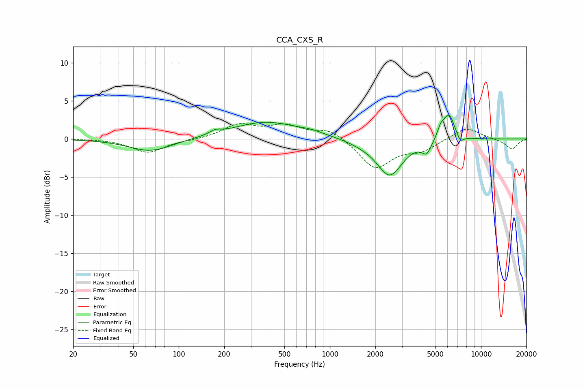

# CCA_CXS_R
See [usage instructions](https://github.com/jaakkopasanen/AutoEq#usage) for more options and info.

### Parametric EQs
Apply preamp of -3.2 dB when using parametric equalizer.

|   # | Type    |   Fc (Hz) |    Q |   Gain (dB) |
|-----|---------|-----------|------|-------------|
|   1 | Peaking |        65 | 1    |        -1.7 |
|   2 | Peaking |       174 | 4.01 |         0.5 |
|   3 | Peaking |       377 | 0.64 |         2.2 |
|   4 | Peaking |       761 | 1.91 |         0.3 |
|   5 | Peaking |      1626 | 1.64 |        -0.3 |
|   6 | Peaking |      2485 | 1.68 |        -4.8 |
|   7 | Peaking |      4366 | 4.53 |        -1.5 |
|   8 | Peaking |      5412 | 6    |         1.3 |
|   9 | Peaking |      6138 | 3.67 |         3.4 |
|  10 | Peaking |      7300 | 6    |        -1   |

### Fixed Band EQs
When using fixed band (also called graphic) equalizer, apply preamp of **-2.1 dB** (if available) and set gains manually with these parameters.

|   # | Type    |   Fc (Hz) |    Q |   Gain (dB) |
|-----|---------|-----------|------|-------------|
|   1 | Peaking |        31 | 1.41 |         0   |
|   2 | Peaking |        62 | 1.41 |        -1.8 |
|   3 | Peaking |       125 | 1.41 |        -0.1 |
|   4 | Peaking |       250 | 1.41 |         1.8 |
|   5 | Peaking |       500 | 1.41 |         1.6 |
|   6 | Peaking |      1000 | 1.41 |         1.3 |
|   7 | Peaking |      2000 | 1.41 |        -3.9 |
|   8 | Peaking |      4000 | 1.41 |        -1.4 |
|   9 | Peaking |      8000 | 1.41 |         1.6 |
|  10 | Peaking |     16000 | 1.41 |        -1.3 |

### Graphs

