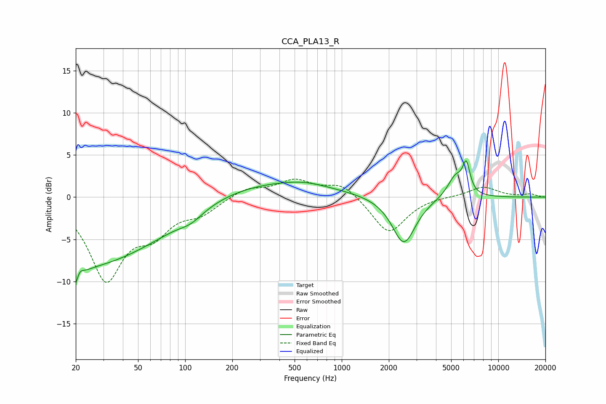

# CCA_PLA13_R
See [usage instructions](https://github.com/jaakkopasanen/AutoEq#usage) for more options and info.

### Parametric EQs
Apply preamp of -4.4 dB when using parametric equalizer.

|   # | Type    |   Fc (Hz) |    Q |   Gain (dB) |
|-----|---------|-----------|------|-------------|
|   1 | Peaking |        20 | 3.97 |        -5.8 |
|   2 | Peaking |        21 | 0.42 |        -6.6 |
|   3 | Peaking |        21 | 5.03 |         3.8 |
|   4 | Peaking |        59 | 0.46 |        -2.7 |
|   5 | Peaking |       109 | 1.89 |        -0.9 |
|   6 | Peaking |       332 | 0.35 |         1.9 |
|   7 | Peaking |       579 | 1.08 |         0.4 |
|   8 | Peaking |      2494 | 1.9  |        -5.7 |
|   9 | Peaking |      5329 | 2.7  |         2.5 |
|  10 | Peaking |      6255 | 5.88 |         3.3 |

### Fixed Band EQs
When using fixed band (also called graphic) equalizer, apply preamp of **-2.2 dB** (if available) and set gains manually with these parameters.

|   # | Type    |   Fc (Hz) |    Q |   Gain (dB) |
|-----|---------|-----------|------|-------------|
|   1 | Peaking |        31 | 1.41 |        -9.4 |
|   2 | Peaking |        62 | 1.41 |        -3.4 |
|   3 | Peaking |       125 | 1.41 |        -1.6 |
|   4 | Peaking |       250 | 1.41 |         1.1 |
|   5 | Peaking |       500 | 1.41 |         1.9 |
|   6 | Peaking |      1000 | 1.41 |         1.7 |
|   7 | Peaking |      2000 | 1.41 |        -4.4 |
|   8 | Peaking |      4000 | 1.41 |         0.1 |
|   9 | Peaking |      8000 | 1.41 |         1.2 |
|  10 | Peaking |     16000 | 1.41 |         0.3 |

### Graphs

