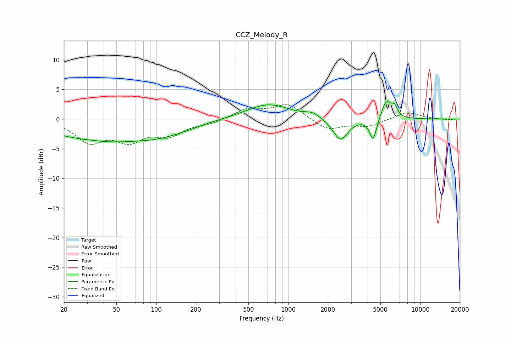

# CCZ_Melody_R
See [usage instructions](https://github.com/jaakkopasanen/AutoEq#usage) for more options and info.

### Parametric EQs
Apply preamp of -3.1 dB when using parametric equalizer.

|   # | Type    |   Fc (Hz) |    Q |   Gain (dB) |
|-----|---------|-----------|------|-------------|
|   1 | Peaking |        32 | 1.13 |         0.4 |
|   2 | Peaking |        35 | 0.44 |        -3.7 |
|   3 | Peaking |       107 | 0.71 |        -1.8 |
|   4 | Peaking |       173 | 1.25 |        -0.3 |
|   5 | Peaking |       708 | 0.86 |         2.5 |
|   6 | Peaking |      1535 | 2.57 |         0.8 |
|   7 | Peaking |      2488 | 2.52 |        -3.7 |
|   8 | Peaking |      4401 | 5.48 |        -3.7 |
|   9 | Peaking |      5546 | 3.89 |         3.1 |
|  10 | Peaking |      6391 | 6    |         1.6 |

### Fixed Band EQs
When using fixed band (also called graphic) equalizer, apply preamp of **-2.5 dB** (if available) and set gains manually with these parameters.

|   # | Type    |   Fc (Hz) |    Q |   Gain (dB) |
|-----|---------|-----------|------|-------------|
|   1 | Peaking |        31 | 1.41 |        -3.6 |
|   2 | Peaking |        62 | 1.41 |        -3.2 |
|   3 | Peaking |       125 | 1.41 |        -2.5 |
|   4 | Peaking |       250 | 1.41 |        -0.7 |
|   5 | Peaking |       500 | 1.41 |         1.7 |
|   6 | Peaking |      1000 | 1.41 |         2.5 |
|   7 | Peaking |      2000 | 1.41 |        -1.9 |
|   8 | Peaking |      4000 | 1.41 |        -1.2 |
|   9 | Peaking |      8000 | 1.41 |         1.2 |
|  10 | Peaking |     16000 | 1.41 |        -0.2 |

### Graphs

