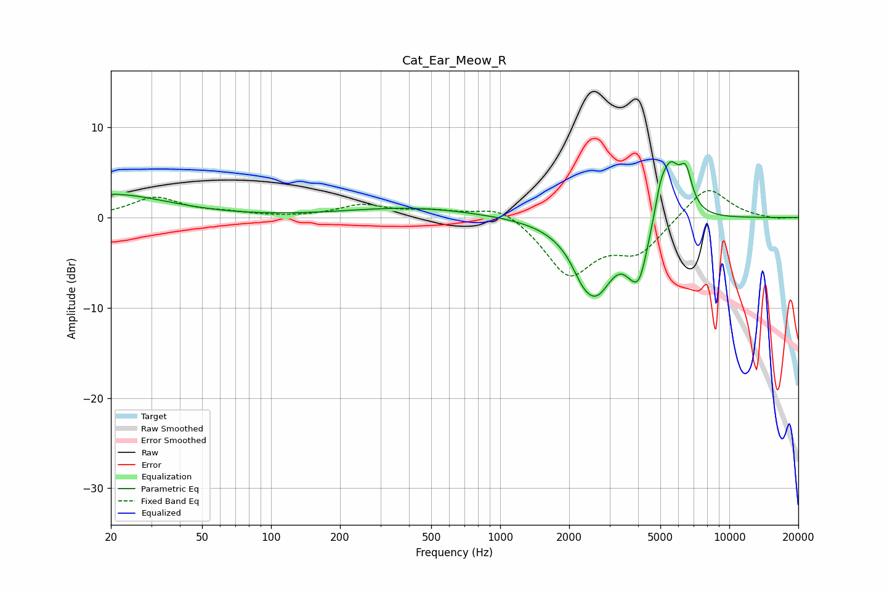

# Cat_Ear_Meow_R
See [usage instructions](https://github.com/jaakkopasanen/AutoEq#usage) for more options and info.

### Parametric EQs
Apply preamp of -6.3 dB when using parametric equalizer.

|   # | Type    |   Fc (Hz) |    Q |   Gain (dB) |
|-----|---------|-----------|------|-------------|
|   1 | Peaking |        20 | 0.58 |         2.6 |
|   2 | Peaking |       407 | 0.5  |         1.1 |
|   3 | Peaking |       784 | 3.82 |        -0   |
|   4 | Peaking |      2264 | 3.59 |        -1.1 |
|   5 | Peaking |      2607 | 1.69 |        -8   |
|   6 | Peaking |      3658 | 4.51 |        -0.8 |
|   7 | Peaking |      4039 | 3.53 |        -5.5 |
|   8 | Peaking |      5005 | 5.97 |         2   |
|   9 | Peaking |      5514 | 3.1  |         6.2 |
|  10 | Peaking |      6463 | 4.99 |         3.9 |

### Fixed Band EQs
When using fixed band (also called graphic) equalizer, apply preamp of **-3.1 dB** (if available) and set gains manually with these parameters.

|   # | Type    |   Fc (Hz) |    Q |   Gain (dB) |
|-----|---------|-----------|------|-------------|
|   1 | Peaking |        31 | 1.41 |         2.2 |
|   2 | Peaking |        62 | 1.41 |         0.4 |
|   3 | Peaking |       125 | 1.41 |        -0   |
|   4 | Peaking |       250 | 1.41 |         1.3 |
|   5 | Peaking |       500 | 1.41 |         0.6 |
|   6 | Peaking |      1000 | 1.41 |         1.6 |
|   7 | Peaking |      2000 | 1.41 |        -6.2 |
|   8 | Peaking |      4000 | 1.41 |        -3.6 |
|   9 | Peaking |      8000 | 1.41 |         3.6 |
|  10 | Peaking |     16000 | 1.41 |        -0.2 |

### Graphs

