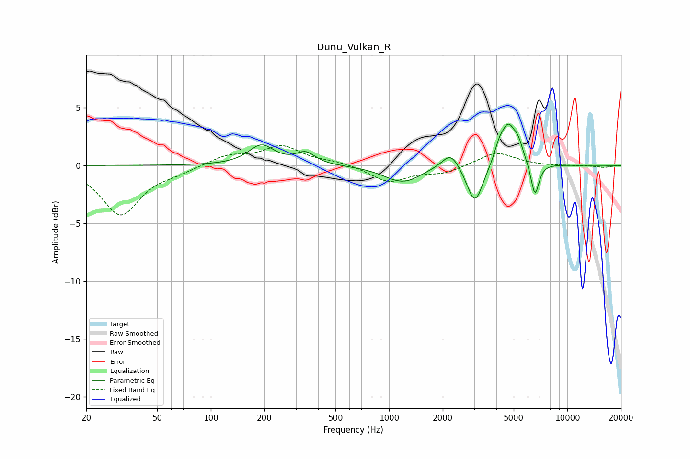

# Dunu_Vulkan_R
See [usage instructions](https://github.com/jaakkopasanen/AutoEq#usage) for more options and info.

### Parametric EQs
Apply preamp of -3.7 dB when using parametric equalizer.

|   # | Type    |   Fc (Hz) |    Q |   Gain (dB) |
|-----|---------|-----------|------|-------------|
|   1 | Peaking |       192 | 1.98 |         1.7 |
|   2 | Peaking |       340 | 2.65 |         1   |
|   3 | Peaking |      1166 | 1.39 |        -1.3 |
|   4 | Peaking |      1346 | 2.14 |        -0.2 |
|   5 | Peaking |      2218 | 2.89 |         1.5 |
|   6 | Peaking |      3034 | 3.15 |        -3.5 |
|   7 | Peaking |      4130 | 6    |         0.8 |
|   8 | Peaking |      4647 | 3.12 |         3.5 |
|   9 | Peaking |      5319 | 5.29 |         1.1 |
|  10 | Peaking |      6585 | 6    |        -2.9 |

### Fixed Band EQs
When using fixed band (also called graphic) equalizer, apply preamp of **-1.8 dB** (if available) and set gains manually with these parameters.

|   # | Type    |   Fc (Hz) |    Q |   Gain (dB) |
|-----|---------|-----------|------|-------------|
|   1 | Peaking |        31 | 1.41 |        -4.2 |
|   2 | Peaking |        62 | 1.41 |        -0.4 |
|   3 | Peaking |       125 | 1.41 |         0.8 |
|   4 | Peaking |       250 | 1.41 |         1.6 |
|   5 | Peaking |       500 | 1.41 |         0.3 |
|   6 | Peaking |      1000 | 1.41 |        -1.4 |
|   7 | Peaking |      2000 | 1.41 |        -0.6 |
|   8 | Peaking |      4000 | 1.41 |         1.2 |
|   9 | Peaking |      8000 | 1.41 |        -0.1 |
|  10 | Peaking |     16000 | 1.41 |        -0.2 |

### Graphs

