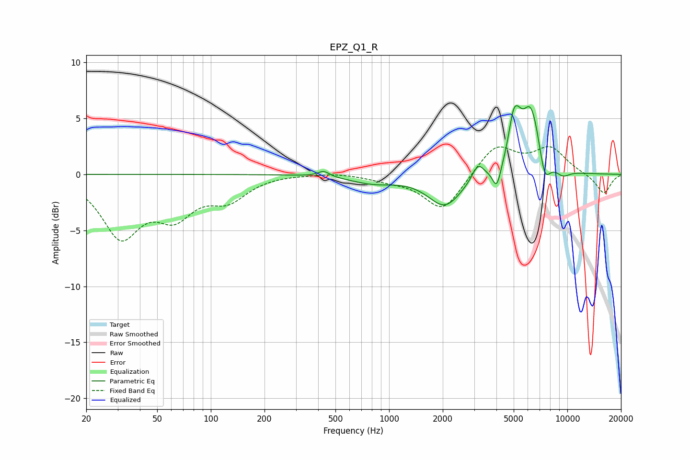

# EPZ_Q1_R
See [usage instructions](https://github.com/jaakkopasanen/AutoEq#usage) for more options and info.

### Parametric EQs
Apply preamp of -6.2 dB when using parametric equalizer.

|   # | Type    |   Fc (Hz) |    Q |   Gain (dB) |
|-----|---------|-----------|------|-------------|
|   1 | Peaking |       429 | 4.37 |         0.5 |
|   2 | Peaking |       813 | 1.11 |        -0.7 |
|   3 | Peaking |      2057 | 1.5  |        -2.8 |
|   4 | Peaking |      3152 | 4.32 |         1.4 |
|   5 | Peaking |      4019 | 6    |        -2   |
|   6 | Peaking |      4995 | 4.95 |         3.5 |
|   7 | Peaking |      5351 | 6    |         0.8 |
|   8 | Peaking |      6242 | 2.46 |         6.1 |
|   9 | Peaking |      7454 | 4.26 |        -2.6 |
|  10 | Peaking |      9433 | 3.24 |        -0.6 |

### Fixed Band EQs
When using fixed band (also called graphic) equalizer, apply preamp of **-2.6 dB** (if available) and set gains manually with these parameters.

|   # | Type    |   Fc (Hz) |    Q |   Gain (dB) |
|-----|---------|-----------|------|-------------|
|   1 | Peaking |        31 | 1.41 |        -5.3 |
|   2 | Peaking |        62 | 1.41 |        -3.2 |
|   3 | Peaking |       125 | 1.41 |        -2   |
|   4 | Peaking |       250 | 1.41 |         0.1 |
|   5 | Peaking |       500 | 1.41 |         0.2 |
|   6 | Peaking |      1000 | 1.41 |        -0.4 |
|   7 | Peaking |      2000 | 1.41 |        -3.3 |
|   8 | Peaking |      4000 | 1.41 |         2.7 |
|   9 | Peaking |      8000 | 1.41 |         2.3 |
|  10 | Peaking |     16000 | 1.41 |        -1.8 |

### Graphs

