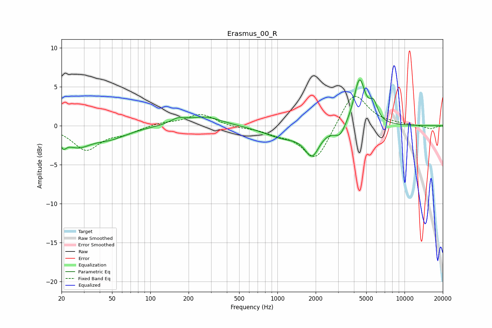

# Erasmus_00_R
See [usage instructions](https://github.com/jaakkopasanen/AutoEq#usage) for more options and info.

### Parametric EQs
Apply preamp of -6.0 dB when using parametric equalizer.

|   # | Type    |   Fc (Hz) |    Q |   Gain (dB) |
|-----|---------|-----------|------|-------------|
|   1 | Peaking |        21 | 5.62 |        -1.2 |
|   2 | Peaking |        27 | 1.34 |        -2.2 |
|   3 | Peaking |        48 | 0.99 |        -1.3 |
|   4 | Peaking |       165 | 2.32 |         0.7 |
|   5 | Peaking |       273 | 1.1  |         1.2 |
|   6 | Peaking |      1120 | 0.95 |        -1.4 |
|   7 | Peaking |      1873 | 2.5  |        -3.3 |
|   8 | Peaking |      3100 | 3.29 |        -1.4 |
|   9 | Peaking |      4421 | 3.2  |         6   |
|  10 | Peaking |      5711 | 4.43 |         2.2 |

### Fixed Band EQs
When using fixed band (also called graphic) equalizer, apply preamp of **-3.9 dB** (if available) and set gains manually with these parameters.

|   # | Type    |   Fc (Hz) |    Q |   Gain (dB) |
|-----|---------|-----------|------|-------------|
|   1 | Peaking |        31 | 1.41 |        -3   |
|   2 | Peaking |        62 | 1.41 |        -0.8 |
|   3 | Peaking |       125 | 1.41 |         0.4 |
|   4 | Peaking |       250 | 1.41 |         1.5 |
|   5 | Peaking |       500 | 1.41 |        -0.2 |
|   6 | Peaking |      1000 | 1.41 |        -0.8 |
|   7 | Peaking |      2000 | 1.41 |        -4.6 |
|   8 | Peaking |      4000 | 1.41 |         4.6 |
|   9 | Peaking |      8000 | 1.41 |         0.2 |
|  10 | Peaking |     16000 | 1.41 |        -0.4 |

### Graphs

