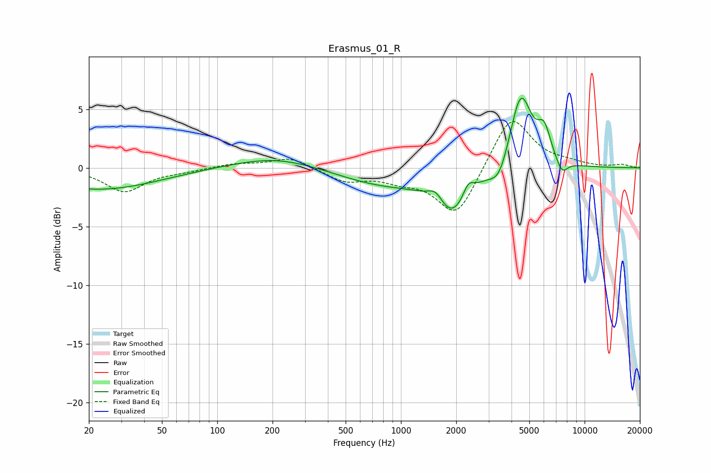

# Erasmus_01_R
See [usage instructions](https://github.com/jaakkopasanen/AutoEq#usage) for more options and info.

### Parametric EQs
Apply preamp of -6.0 dB when using parametric equalizer.

|   # | Type    |   Fc (Hz) |    Q |   Gain (dB) |
|-----|---------|-----------|------|-------------|
|   1 | Peaking |        23 | 0.44 |        -1.8 |
|   2 | Peaking |       210 | 0.6  |         1   |
|   3 | Peaking |       804 | 0.55 |        -1.4 |
|   4 | Peaking |      1547 | 3.39 |         1.1 |
|   5 | Peaking |      1898 | 1.49 |        -3.6 |
|   6 | Peaking |      2327 | 4.61 |         1.2 |
|   7 | Peaking |      3421 | 2.82 |        -1.8 |
|   8 | Peaking |      4490 | 2.35 |         6.5 |
|   9 | Peaking |      6024 | 3.76 |         2.5 |
|  10 | Peaking |      7522 | 4.3  |        -1.2 |

### Fixed Band EQs
When using fixed band (also called graphic) equalizer, apply preamp of **-4.0 dB** (if available) and set gains manually with these parameters.

|   # | Type    |   Fc (Hz) |    Q |   Gain (dB) |
|-----|---------|-----------|------|-------------|
|   1 | Peaking |        31 | 1.41 |        -2   |
|   2 | Peaking |        62 | 1.41 |        -0.2 |
|   3 | Peaking |       125 | 1.41 |         0.3 |
|   4 | Peaking |       250 | 1.41 |         0.9 |
|   5 | Peaking |       500 | 1.41 |        -1.1 |
|   6 | Peaking |      1000 | 1.41 |        -0.8 |
|   7 | Peaking |      2000 | 1.41 |        -4.2 |
|   8 | Peaking |      4000 | 1.41 |         4.6 |
|   9 | Peaking |      8000 | 1.41 |         0.3 |
|  10 | Peaking |     16000 | 1.41 |         0.3 |

### Graphs

