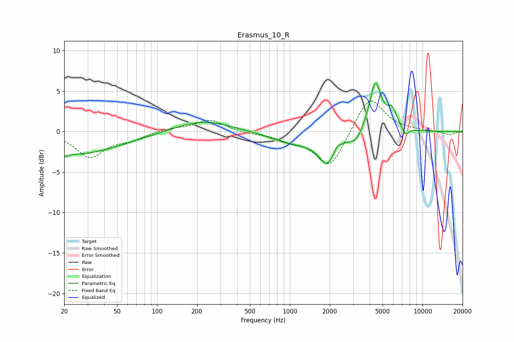

# Erasmus_10_R
See [usage instructions](https://github.com/jaakkopasanen/AutoEq#usage) for more options and info.

### Parametric EQs
Apply preamp of -6.0 dB when using parametric equalizer.

|   # | Type    |   Fc (Hz) |    Q |   Gain (dB) |
|-----|---------|-----------|------|-------------|
|   1 | Peaking |        20 | 5.07 |        -0.4 |
|   2 | Peaking |        24 | 0.4  |        -2.8 |
|   3 | Peaking |       221 | 0.68 |         1.4 |
|   4 | Peaking |      1049 | 0.86 |        -1.3 |
|   5 | Peaking |      1952 | 2.02 |        -3.8 |
|   6 | Peaking |      2249 | 4.09 |         1.2 |
|   7 | Peaking |      3153 | 2.96 |        -1.2 |
|   8 | Peaking |      4409 | 3.09 |         6.2 |
|   9 | Peaking |      5884 | 3.68 |         2.2 |
|  10 | Peaking |      7429 | 5.67 |        -1   |

### Fixed Band EQs
When using fixed band (also called graphic) equalizer, apply preamp of **-3.9 dB** (if available) and set gains manually with these parameters.

|   # | Type    |   Fc (Hz) |    Q |   Gain (dB) |
|-----|---------|-----------|------|-------------|
|   1 | Peaking |        31 | 1.41 |        -3.1 |
|   2 | Peaking |        62 | 1.41 |        -0.9 |
|   3 | Peaking |       125 | 1.41 |         0.4 |
|   4 | Peaking |       250 | 1.41 |         1.5 |
|   5 | Peaking |       500 | 1.41 |        -0.2 |
|   6 | Peaking |      1000 | 1.41 |        -0.8 |
|   7 | Peaking |      2000 | 1.41 |        -4.6 |
|   8 | Peaking |      4000 | 1.41 |         4.6 |
|   9 | Peaking |      8000 | 1.41 |         0.1 |
|  10 | Peaking |     16000 | 1.41 |        -0.4 |

### Graphs

