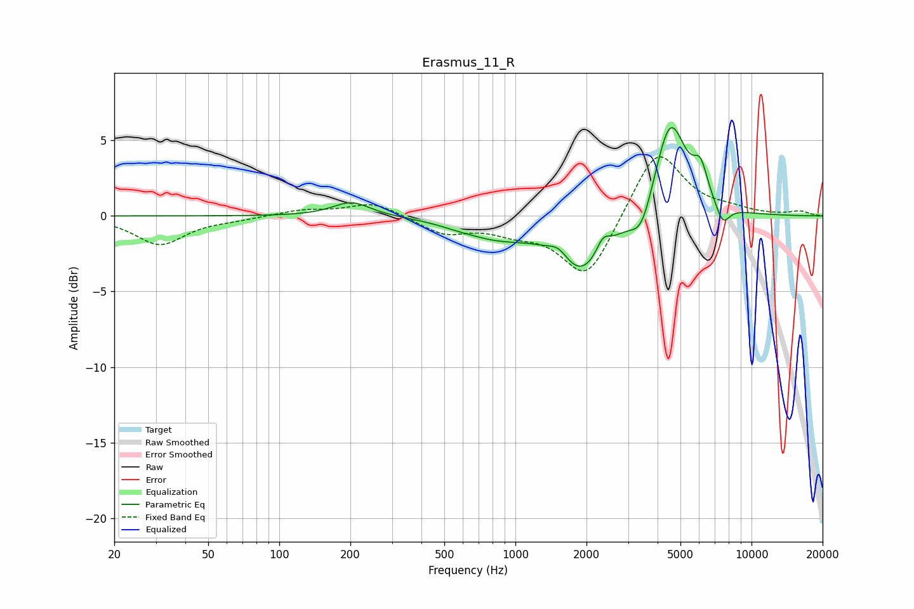

# Erasmus_11_R
See [usage instructions](https://github.com/jaakkopasanen/AutoEq#usage) for more options and info.

### Parametric EQs
Apply preamp of -5.9 dB when using parametric equalizer.

|   # | Type    |   Fc (Hz) |    Q |   Gain (dB) |
|-----|---------|-----------|------|-------------|
|   1 | Peaking |       202 | 1.78 |         1   |
|   2 | Peaking |       586 | 1.4  |        -0.3 |
|   3 | Peaking |       851 | 1.06 |        -1   |
|   4 | Peaking |      1526 | 3.34 |         0.8 |
|   5 | Peaking |      1900 | 1.29 |        -3.8 |
|   6 | Peaking |      2349 | 4.87 |         1.1 |
|   7 | Peaking |      3424 | 3    |        -2   |
|   8 | Peaking |      4525 | 2.06 |         6.6 |
|   9 | Peaking |      6084 | 4.43 |         2.1 |
|  10 | Peaking |      7552 | 4.54 |        -1.3 |

### Fixed Band EQs
When using fixed band (also called graphic) equalizer, apply preamp of **-4.0 dB** (if available) and set gains manually with these parameters.

|   # | Type    |   Fc (Hz) |    Q |   Gain (dB) |
|-----|---------|-----------|------|-------------|
|   1 | Peaking |        31 | 1.41 |        -1.9 |
|   2 | Peaking |        62 | 1.41 |        -0.2 |
|   3 | Peaking |       125 | 1.41 |         0.4 |
|   4 | Peaking |       250 | 1.41 |         0.9 |
|   5 | Peaking |       500 | 1.41 |        -1.1 |
|   6 | Peaking |      1000 | 1.41 |        -0.8 |
|   7 | Peaking |      2000 | 1.41 |        -4.2 |
|   8 | Peaking |      4000 | 1.41 |         4.6 |
|   9 | Peaking |      8000 | 1.41 |         0.3 |
|  10 | Peaking |     16000 | 1.41 |         0.3 |

### Graphs

