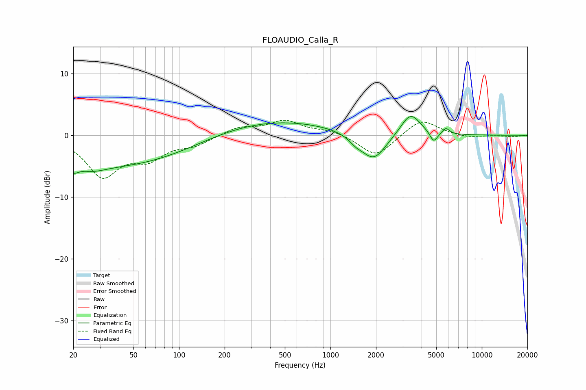

# FLOAUDIO_Calla_R
See [usage instructions](https://github.com/jaakkopasanen/AutoEq#usage) for more options and info.

### Parametric EQs
Apply preamp of -3.1 dB when using parametric equalizer.

|   # | Type    |   Fc (Hz) |    Q |   Gain (dB) |
|-----|---------|-----------|------|-------------|
|   1 | Peaking |        20 | 4.25 |        -1.4 |
|   2 | Peaking |        26 | 1.53 |        -1.1 |
|   3 | Peaking |        40 | 0.28 |        -4.9 |
|   4 | Peaking |       400 | 0.34 |         2.6 |
|   5 | Peaking |       978 | 0.63 |        -0.1 |
|   6 | Peaking |      1470 | 3.16 |        -0.9 |
|   7 | Peaking |      1929 | 1.71 |        -4.4 |
|   8 | Peaking |      3382 | 2.18 |         3.7 |
|   9 | Peaking |      4806 | 5.59 |        -1.8 |
|  10 | Peaking |      5790 | 6    |         1   |

### Fixed Band EQs
When using fixed band (also called graphic) equalizer, apply preamp of **-2.5 dB** (if available) and set gains manually with these parameters.

|   # | Type    |   Fc (Hz) |    Q |   Gain (dB) |
|-----|---------|-----------|------|-------------|
|   1 | Peaking |        31 | 1.41 |        -6.3 |
|   2 | Peaking |        62 | 1.41 |        -3.2 |
|   3 | Peaking |       125 | 1.41 |        -1.4 |
|   4 | Peaking |       250 | 1.41 |         1.3 |
|   5 | Peaking |       500 | 1.41 |         2.3 |
|   6 | Peaking |      1000 | 1.41 |         0.8 |
|   7 | Peaking |      2000 | 1.41 |        -3.6 |
|   8 | Peaking |      4000 | 1.41 |         2.8 |
|   9 | Peaking |      8000 | 1.41 |        -0.4 |
|  10 | Peaking |     16000 | 1.41 |        -0.2 |

### Graphs

