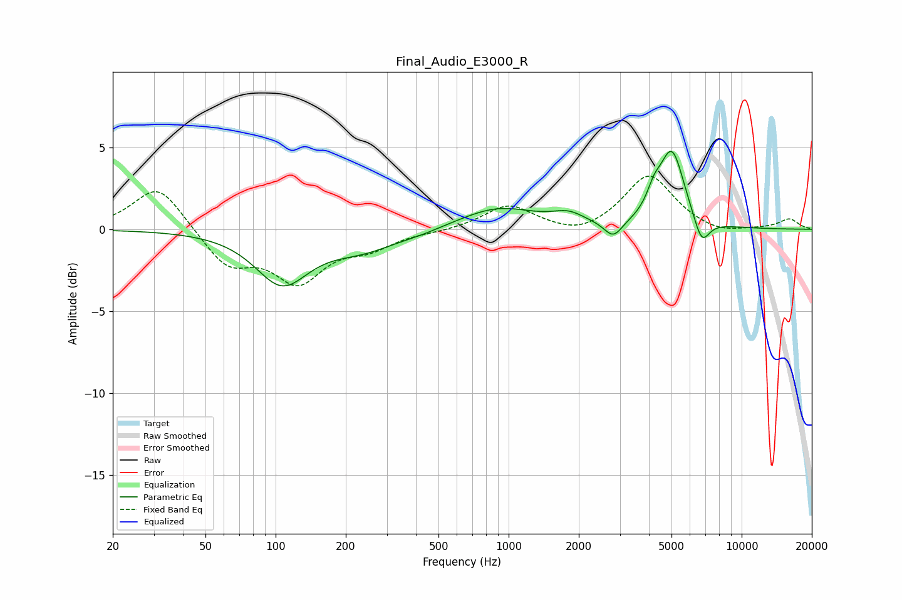

# Final_Audio_E3000_R
See [usage instructions](https://github.com/jaakkopasanen/AutoEq#usage) for more options and info.

### Parametric EQs
Apply preamp of -4.8 dB when using parametric equalizer.

|   # | Type    |   Fc (Hz) |    Q |   Gain (dB) |
|-----|---------|-----------|------|-------------|
|   1 | Peaking |       107 | 1.28 |        -3.5 |
|   2 | Peaking |       107 | 1.58 |         0.3 |
|   3 | Peaking |       236 | 0.93 |        -1.1 |
|   4 | Peaking |       414 | 1.52 |        -0.2 |
|   5 | Peaking |       902 | 0.86 |         1.3 |
|   6 | Peaking |      1806 | 2.09 |         0.6 |
|   7 | Peaking |      2814 | 3.59 |        -1   |
|   8 | Peaking |      4201 | 4.62 |         1   |
|   9 | Peaking |      5018 | 2.58 |         4.7 |
|  10 | Peaking |      6736 | 4.04 |        -1.7 |

### Fixed Band EQs
When using fixed band (also called graphic) equalizer, apply preamp of **-3.3 dB** (if available) and set gains manually with these parameters.

|   # | Type    |   Fc (Hz) |    Q |   Gain (dB) |
|-----|---------|-----------|------|-------------|
|   1 | Peaking |        31 | 1.41 |         2.8 |
|   2 | Peaking |        62 | 1.41 |        -2.2 |
|   3 | Peaking |       125 | 1.41 |        -3   |
|   4 | Peaking |       250 | 1.41 |        -1   |
|   5 | Peaking |       500 | 1.41 |        -0.1 |
|   6 | Peaking |      1000 | 1.41 |         1.5 |
|   7 | Peaking |      2000 | 1.41 |        -0.5 |
|   8 | Peaking |      4000 | 1.41 |         3.3 |
|   9 | Peaking |      8000 | 1.41 |        -0.4 |
|  10 | Peaking |     16000 | 1.41 |         0.6 |

### Graphs

