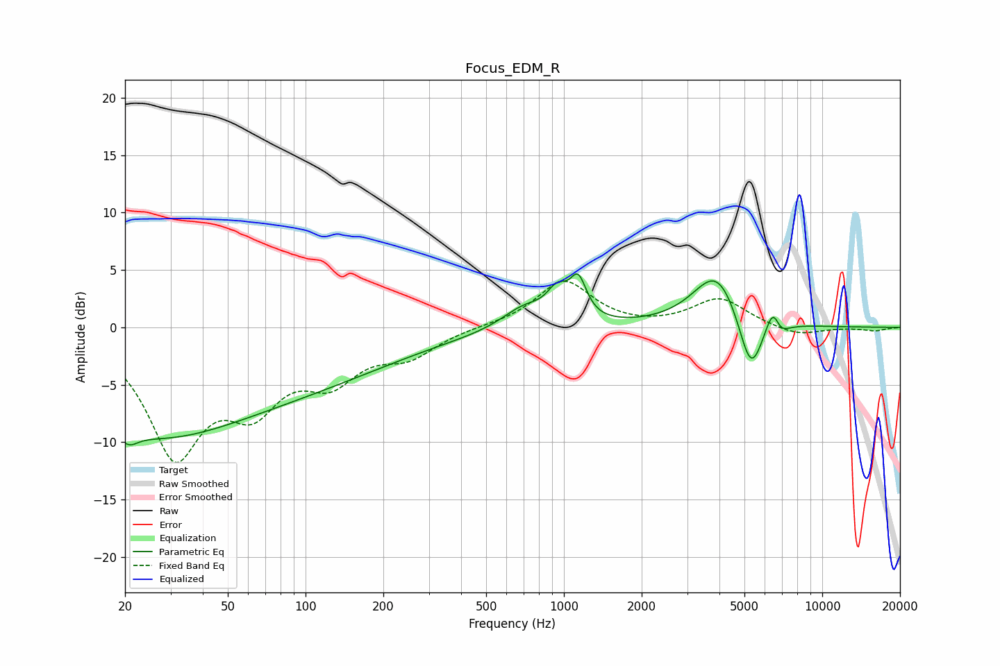

# Focus_EDM_R
See [usage instructions](https://github.com/jaakkopasanen/AutoEq#usage) for more options and info.

### Parametric EQs
Apply preamp of -4.8 dB when using parametric equalizer.

|   # | Type    |   Fc (Hz) |    Q |   Gain (dB) |
|-----|---------|-----------|------|-------------|
|   1 | Peaking |        21 | 4.15 |        -1.1 |
|   2 | Peaking |        26 | 0.47 |        -3.6 |
|   3 | Peaking |        38 | 0.18 |        -6.1 |
|   4 | Peaking |       702 | 1.6  |         1.9 |
|   5 | Peaking |       942 | 3.59 |         2.3 |
|   6 | Peaking |      1136 | 4.4  |         3.3 |
|   7 | Peaking |      3924 | 1.51 |         5.1 |
|   8 | Peaking |      5292 | 2.87 |        -5.6 |
|   9 | Peaking |      6501 | 4.43 |         3.8 |
|  10 | Peaking |      6727 | 4.12 |        -2.4 |

### Fixed Band EQs
When using fixed band (also called graphic) equalizer, apply preamp of **-4.1 dB** (if available) and set gains manually with these parameters.

|   # | Type    |   Fc (Hz) |    Q |   Gain (dB) |
|-----|---------|-----------|------|-------------|
|   1 | Peaking |        31 | 1.41 |       -10.6 |
|   2 | Peaking |        62 | 1.41 |        -5.5 |
|   3 | Peaking |       125 | 1.41 |        -3.8 |
|   4 | Peaking |       250 | 1.41 |        -2.2 |
|   5 | Peaking |       500 | 1.41 |         0.1 |
|   6 | Peaking |      1000 | 1.41 |         4.1 |
|   7 | Peaking |      2000 | 1.41 |        -0.1 |
|   8 | Peaking |      4000 | 1.41 |         2.5 |
|   9 | Peaking |      8000 | 1.41 |        -0.8 |
|  10 | Peaking |     16000 | 1.41 |        -0.3 |

### Graphs

