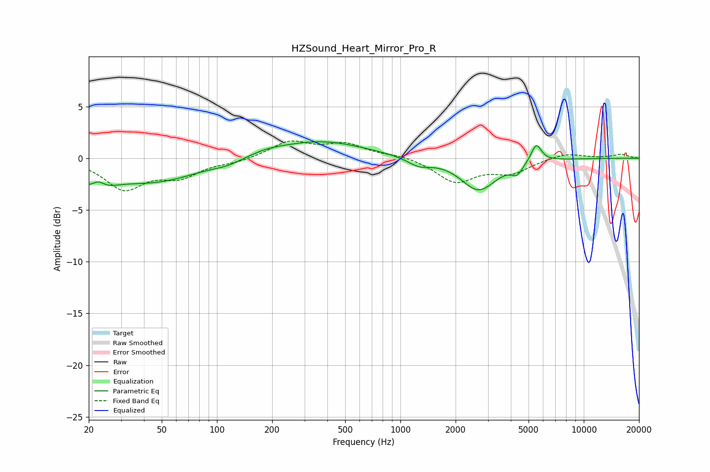

# HZSound_Heart_Mirror_Pro_R
See [usage instructions](https://github.com/jaakkopasanen/AutoEq#usage) for more options and info.

### Parametric EQs
Apply preamp of -1.7 dB when using parametric equalizer.

|   # | Type    |   Fc (Hz) |    Q |   Gain (dB) |
|-----|---------|-----------|------|-------------|
|   1 | Peaking |        22 | 1.73 |        -2.4 |
|   2 | Peaking |        22 | 3.68 |         1.3 |
|   3 | Peaking |        45 | 0.57 |        -2.2 |
|   4 | Peaking |       114 | 1.98 |        -0.3 |
|   5 | Peaking |       188 | 1.57 |         0.3 |
|   6 | Peaking |       361 | 0.57 |         1.7 |
|   7 | Peaking |      1265 | 2.22 |        -0.8 |
|   8 | Peaking |      2672 | 1.47 |        -3.1 |
|   9 | Peaking |      4325 | 4.52 |        -1   |
|  10 | Peaking |      5507 | 4.89 |         1.8 |

### Fixed Band EQs
When using fixed band (also called graphic) equalizer, apply preamp of **-1.8 dB** (if available) and set gains manually with these parameters.

|   # | Type    |   Fc (Hz) |    Q |   Gain (dB) |
|-----|---------|-----------|------|-------------|
|   1 | Peaking |        31 | 1.41 |        -2.9 |
|   2 | Peaking |        62 | 1.41 |        -1.6 |
|   3 | Peaking |       125 | 1.41 |        -0.3 |
|   4 | Peaking |       250 | 1.41 |         1.6 |
|   5 | Peaking |       500 | 1.41 |         1.3 |
|   6 | Peaking |      1000 | 1.41 |         0.3 |
|   7 | Peaking |      2000 | 1.41 |        -2.3 |
|   8 | Peaking |      4000 | 1.41 |        -1.3 |
|   9 | Peaking |      8000 | 1.41 |         0.5 |
|  10 | Peaking |     16000 | 1.41 |         0.4 |

### Graphs

