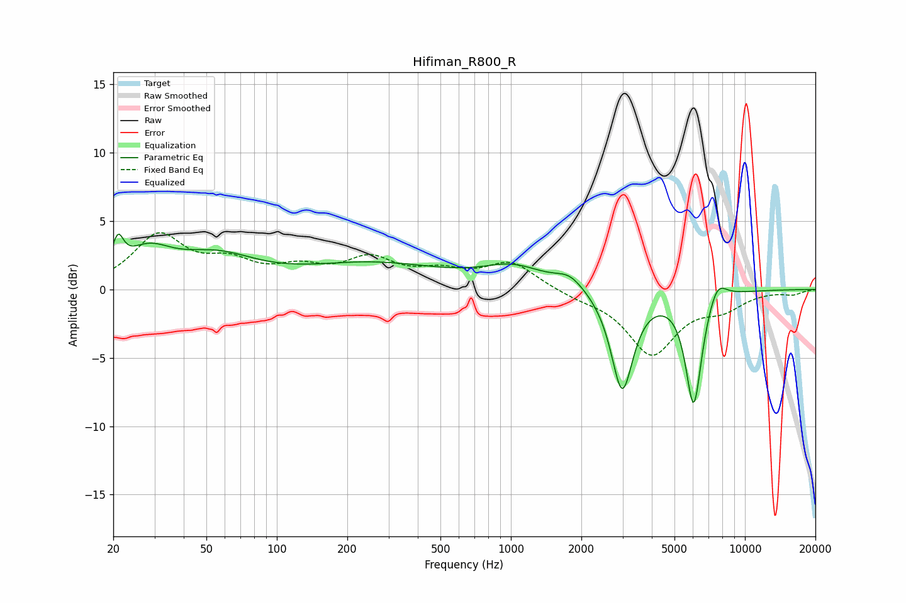

# Hifiman_R800_R
See [usage instructions](https://github.com/jaakkopasanen/AutoEq#usage) for more options and info.

### Parametric EQs
Apply preamp of -4.1 dB when using parametric equalizer.

|   # | Type    |   Fc (Hz) |    Q |   Gain (dB) |
|-----|---------|-----------|------|-------------|
|   1 | Peaking |        21 | 6    |         2.2 |
|   2 | Peaking |        28 | 1.4  |         2.3 |
|   3 | Peaking |        55 | 0.83 |         2.1 |
|   4 | Peaking |       156 | 2.28 |        -0   |
|   5 | Peaking |       259 | 0.47 |         1.8 |
|   6 | Peaking |      1026 | 1.07 |         1.4 |
|   7 | Peaking |      1782 | 2.32 |         0.9 |
|   8 | Peaking |      2989 | 3.01 |        -7.4 |
|   9 | Peaking |      6040 | 3.95 |        -8.4 |
|  10 | Peaking |      7611 | 3.36 |         1.5 |

### Fixed Band EQs
When using fixed band (also called graphic) equalizer, apply preamp of **-4.2 dB** (if available) and set gains manually with these parameters.

|   # | Type    |   Fc (Hz) |    Q |   Gain (dB) |
|-----|---------|-----------|------|-------------|
|   1 | Peaking |        31 | 1.41 |         3.8 |
|   2 | Peaking |        62 | 1.41 |         1.6 |
|   3 | Peaking |       125 | 1.41 |         1.2 |
|   4 | Peaking |       250 | 1.41 |         2   |
|   5 | Peaking |       500 | 1.41 |         1   |
|   6 | Peaking |      1000 | 1.41 |         1.9 |
|   7 | Peaking |      2000 | 1.41 |        -0.5 |
|   8 | Peaking |      4000 | 1.41 |        -4.6 |
|   9 | Peaking |      8000 | 1.41 |        -1.2 |
|  10 | Peaking |     16000 | 1.41 |        -0.3 |

### Graphs

