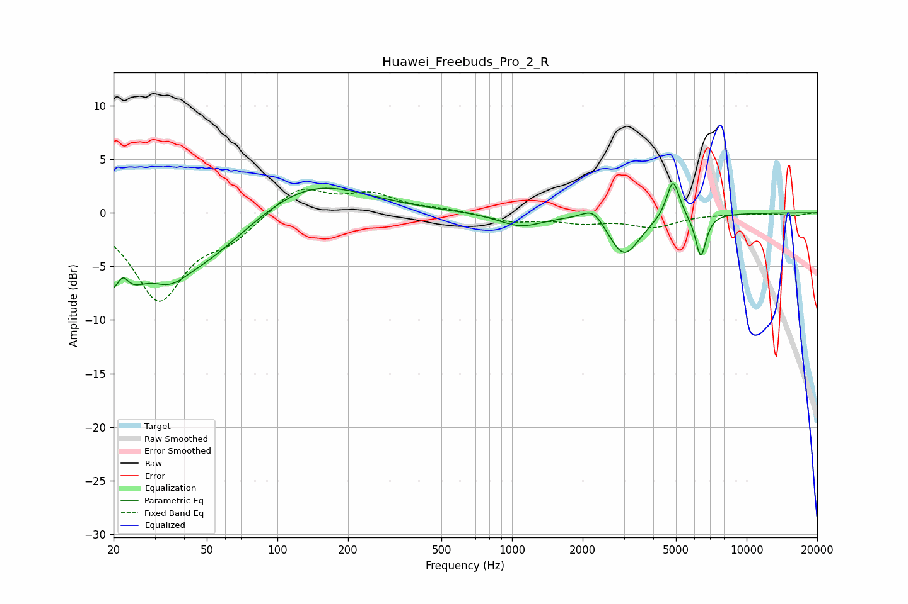

# Huawei_Freebuds_Pro_2_R
See [usage instructions](https://github.com/jaakkopasanen/AutoEq#usage) for more options and info.

### Parametric EQs
Apply preamp of -2.8 dB when using parametric equalizer.

|   # | Type    |   Fc (Hz) |    Q |   Gain (dB) |
|-----|---------|-----------|------|-------------|
|   1 | Peaking |        21 | 1.54 |        -6.5 |
|   2 | Peaking |        22 | 5.27 |         2.3 |
|   3 | Peaking |        35 | 1.97 |        -1.7 |
|   4 | Peaking |        46 | 0.69 |        -4.4 |
|   5 | Peaking |       137 | 0.62 |         3.3 |
|   6 | Peaking |      1086 | 1.48 |        -1.2 |
|   7 | Peaking |      2221 | 2.92 |         1.5 |
|   8 | Peaking |      3002 | 2.09 |        -4   |
|   9 | Peaking |      4856 | 5.16 |         3.7 |
|  10 | Peaking |      6379 | 6    |        -4   |

### Fixed Band EQs
When using fixed band (also called graphic) equalizer, apply preamp of **-2.3 dB** (if available) and set gains manually with these parameters.

|   # | Type    |   Fc (Hz) |    Q |   Gain (dB) |
|-----|---------|-----------|------|-------------|
|   1 | Peaking |        31 | 1.41 |        -8   |
|   2 | Peaking |        62 | 1.41 |        -2   |
|   3 | Peaking |       125 | 1.41 |         2.5 |
|   4 | Peaking |       250 | 1.41 |         1.6 |
|   5 | Peaking |       500 | 1.41 |         0.3 |
|   6 | Peaking |      1000 | 1.41 |        -0.8 |
|   7 | Peaking |      2000 | 1.41 |        -0.8 |
|   8 | Peaking |      4000 | 1.41 |        -1.2 |
|   9 | Peaking |      8000 | 1.41 |        -0.1 |
|  10 | Peaking |     16000 | 1.41 |        -0.3 |

### Graphs

