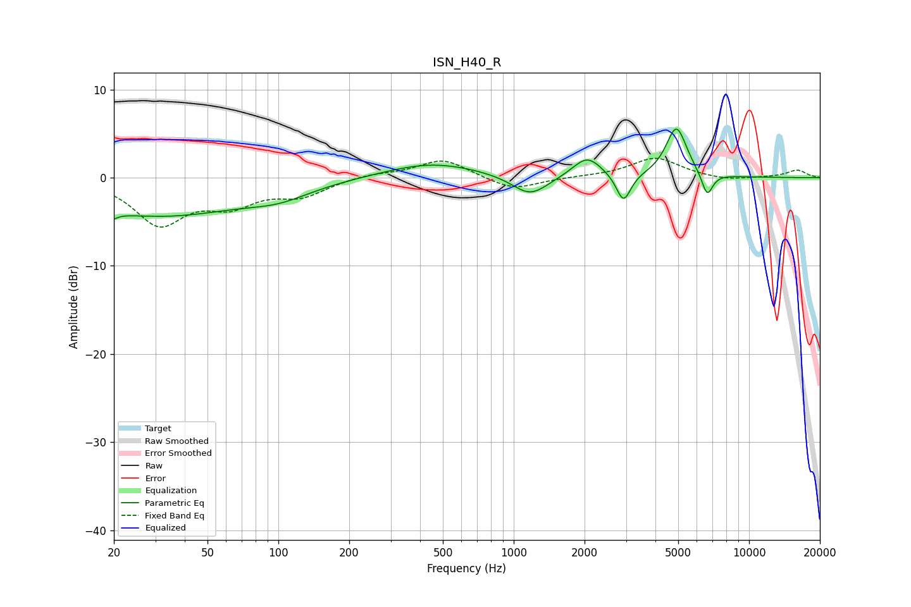

# ISN_H40_R
See [usage instructions](https://github.com/jaakkopasanen/AutoEq#usage) for more options and info.

### Parametric EQs
Apply preamp of -5.6 dB when using parametric equalizer.

|   # | Type    |   Fc (Hz) |    Q |   Gain (dB) |
|-----|---------|-----------|------|-------------|
|   1 | Peaking |        20 | 5.81 |        -4   |
|   2 | Peaking |        20 | 5.88 |         3.2 |
|   3 | Peaking |        30 | 0.37 |        -4.3 |
|   4 | Peaking |       101 | 1.06 |        -1.2 |
|   5 | Peaking |       449 | 0.71 |         1.7 |
|   6 | Peaking |      1174 | 1.85 |        -2.3 |
|   7 | Peaking |      2051 | 2.33 |         2.4 |
|   8 | Peaking |      2929 | 4.65 |        -3.3 |
|   9 | Peaking |      4913 | 3.14 |         5.7 |
|  10 | Peaking |      6637 | 5.69 |        -2.7 |

### Fixed Band EQs
When using fixed band (also called graphic) equalizer, apply preamp of **-2.3 dB** (if available) and set gains manually with these parameters.

|   # | Type    |   Fc (Hz) |    Q |   Gain (dB) |
|-----|---------|-----------|------|-------------|
|   1 | Peaking |        31 | 1.41 |        -5.1 |
|   2 | Peaking |        62 | 1.41 |        -2.6 |
|   3 | Peaking |       125 | 1.41 |        -1.8 |
|   4 | Peaking |       250 | 1.41 |         0.4 |
|   5 | Peaking |       500 | 1.41 |         2.1 |
|   6 | Peaking |      1000 | 1.41 |        -1.5 |
|   7 | Peaking |      2000 | 1.41 |         0.1 |
|   8 | Peaking |      4000 | 1.41 |         2.3 |
|   9 | Peaking |      8000 | 1.41 |        -0.4 |
|  10 | Peaking |     16000 | 1.41 |         0.9 |

### Graphs

