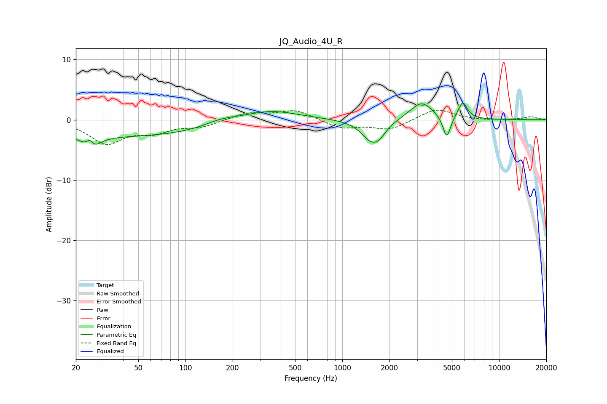

# JQ_Audio_4U_R
See [usage instructions](https://github.com/jaakkopasanen/AutoEq#usage) for more options and info.

### Parametric EQs
Apply preamp of -2.9 dB when using parametric equalizer.

|   # | Type    |   Fc (Hz) |    Q |   Gain (dB) |
|-----|---------|-----------|------|-------------|
|   1 | Peaking |        25 | 5.87 |         2.4 |
|   2 | Peaking |        25 | 3.38 |        -3.2 |
|   3 | Peaking |        36 | 0.18 |        -2.8 |
|   4 | Peaking |       168 | 1.31 |         1   |
|   5 | Peaking |       337 | 0.78 |         1.9 |
|   6 | Peaking |      1553 | 2.16 |        -3.7 |
|   7 | Peaking |      1747 | 3.93 |        -0.8 |
|   8 | Peaking |      3198 | 1.93 |         3   |
|   9 | Peaking |      4636 | 5.68 |        -3.8 |
|  10 | Peaking |      5861 | 4.73 |         2.8 |

### Fixed Band EQs
When using fixed band (also called graphic) equalizer, apply preamp of **-1.7 dB** (if available) and set gains manually with these parameters.

|   # | Type    |   Fc (Hz) |    Q |   Gain (dB) |
|-----|---------|-----------|------|-------------|
|   1 | Peaking |        31 | 1.41 |        -3.8 |
|   2 | Peaking |        62 | 1.41 |        -1.7 |
|   3 | Peaking |       125 | 1.41 |        -1.1 |
|   4 | Peaking |       250 | 1.41 |         1.1 |
|   5 | Peaking |       500 | 1.41 |         1.6 |
|   6 | Peaking |      1000 | 1.41 |        -1.4 |
|   7 | Peaking |      2000 | 1.41 |        -1.6 |
|   8 | Peaking |      4000 | 1.41 |         1.9 |
|   9 | Peaking |      8000 | 1.41 |        -0.1 |
|  10 | Peaking |     16000 | 1.41 |         0.5 |

### Graphs

