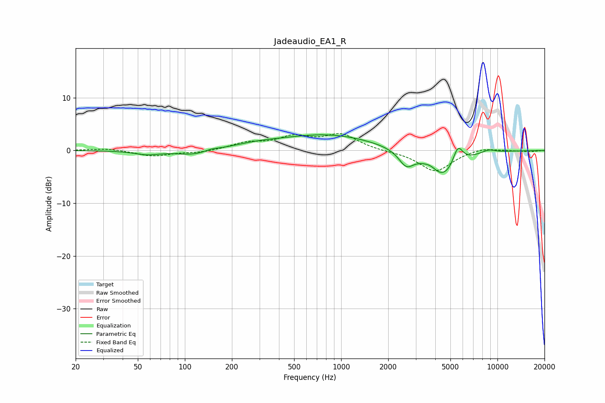

# Jadeaudio_EA1_R
See [usage instructions](https://github.com/jaakkopasanen/AutoEq#usage) for more options and info.

### Parametric EQs
Apply preamp of -3.1 dB when using parametric equalizer.

|   # | Type    |   Fc (Hz) |    Q |   Gain (dB) |
|-----|---------|-----------|------|-------------|
|   1 | Peaking |        57 | 1.79 |        -0.7 |
|   2 | Peaking |       117 | 1.23 |        -1.1 |
|   3 | Peaking |       147 | 3.13 |         0.4 |
|   4 | Peaking |       284 | 0.81 |         0.7 |
|   5 | Peaking |       829 | 0.47 |         2.9 |
|   6 | Peaking |      2610 | 2.94 |        -2.8 |
|   7 | Peaking |      3745 | 3.51 |         0.7 |
|   8 | Peaking |      4501 | 1.41 |        -5.3 |
|   9 | Peaking |      5581 | 4.26 |         3.7 |
|  10 | Peaking |      8777 | 2.91 |         0.6 |

### Fixed Band EQs
When using fixed band (also called graphic) equalizer, apply preamp of **-3.3 dB** (if available) and set gains manually with these parameters.

|   # | Type    |   Fc (Hz) |    Q |   Gain (dB) |
|-----|---------|-----------|------|-------------|
|   1 | Peaking |        31 | 1.41 |         0.4 |
|   2 | Peaking |        62 | 1.41 |        -1.1 |
|   3 | Peaking |       125 | 1.41 |        -0.4 |
|   4 | Peaking |       250 | 1.41 |         1.3 |
|   5 | Peaking |       500 | 1.41 |         2.3 |
|   6 | Peaking |      1000 | 1.41 |         2.9 |
|   7 | Peaking |      2000 | 1.41 |        -0.2 |
|   8 | Peaking |      4000 | 1.41 |        -4   |
|   9 | Peaking |      8000 | 1.41 |         0.6 |
|  10 | Peaking |     16000 | 1.41 |        -0.2 |

### Graphs

