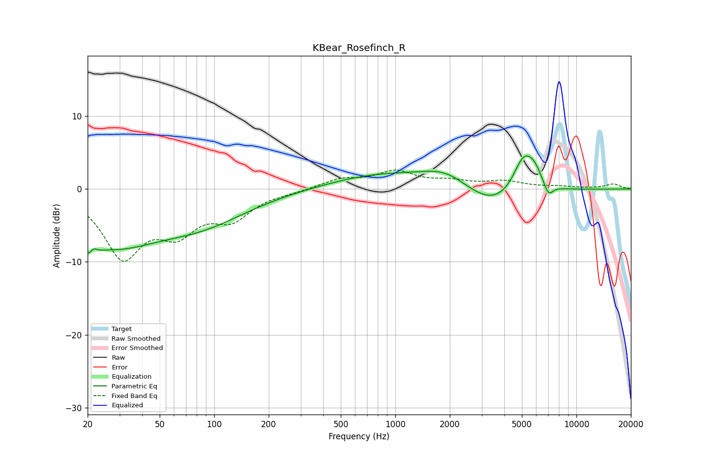

# KBear_Rosefinch_R
See [usage instructions](https://github.com/jaakkopasanen/AutoEq#usage) for more options and info.

### Parametric EQs
Apply preamp of -4.6 dB when using parametric equalizer.

|   # | Type    |   Fc (Hz) |    Q |   Gain (dB) |
|-----|---------|-----------|------|-------------|
|   1 | Peaking |        21 | 4.1  |        -5   |
|   2 | Peaking |        21 | 5.57 |         3.4 |
|   3 | Peaking |        27 | 0.56 |        -6.7 |
|   4 | Peaking |        85 | 0.54 |        -3.9 |
|   5 | Peaking |       820 | 0.52 |         1.9 |
|   6 | Peaking |      1903 | 1.01 |         2.4 |
|   7 | Peaking |      3474 | 0.84 |        -3.2 |
|   8 | Peaking |      5097 | 2.35 |         5   |
|   9 | Peaking |      5867 | 3.06 |         2.1 |
|  10 | Peaking |      7007 | 5.28 |        -1.7 |

### Fixed Band EQs
When using fixed band (also called graphic) equalizer, apply preamp of **-2.7 dB** (if available) and set gains manually with these parameters.

|   # | Type    |   Fc (Hz) |    Q |   Gain (dB) |
|-----|---------|-----------|------|-------------|
|   1 | Peaking |        31 | 1.41 |        -8.9 |
|   2 | Peaking |        62 | 1.41 |        -4.9 |
|   3 | Peaking |       125 | 1.41 |        -3.6 |
|   4 | Peaking |       250 | 1.41 |        -0.3 |
|   5 | Peaking |       500 | 1.41 |         1.3 |
|   6 | Peaking |      1000 | 1.41 |         2.2 |
|   7 | Peaking |      2000 | 1.41 |         0.9 |
|   8 | Peaking |      4000 | 1.41 |         0.9 |
|   9 | Peaking |      8000 | 1.41 |         0.3 |
|  10 | Peaking |     16000 | 1.41 |         0.7 |

### Graphs

